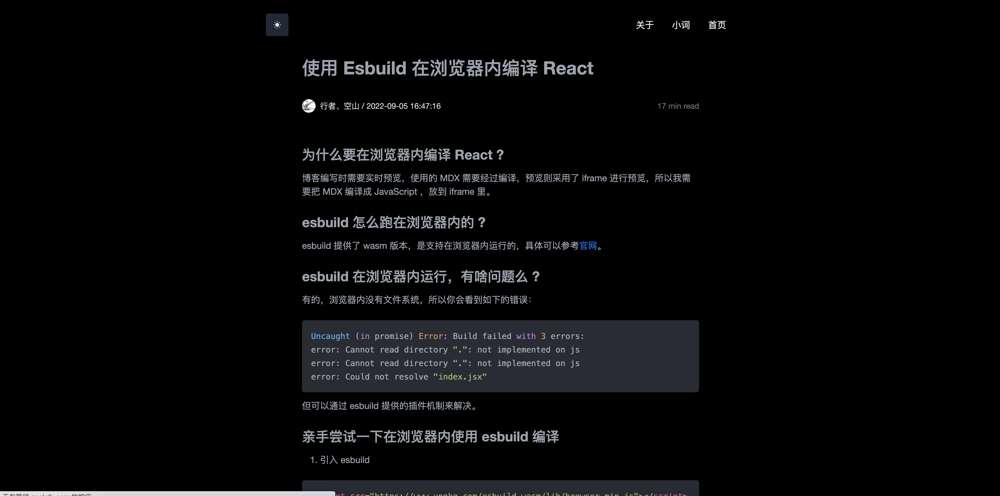
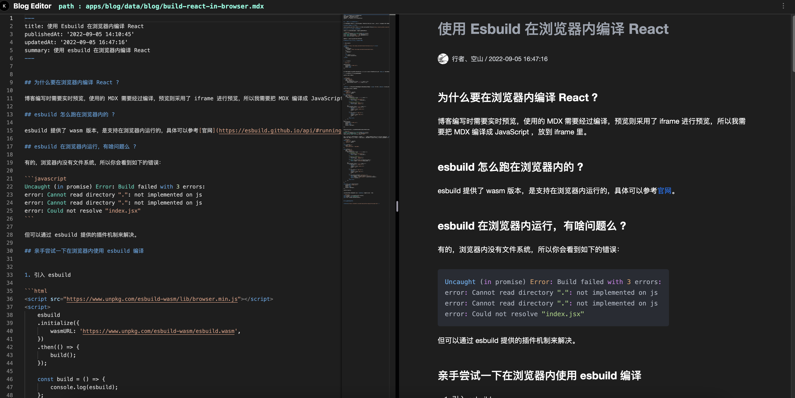

# 行者、空山的博客

尝试使用了下 turborepo，其实没啥必要。

## 预览图片

1. 首页


2. 文章页



3. 文章编辑页面



## 项目结构

- `blog`: 我的博客，使用[Next.js](https://nextjs.org)搭建
<!-- - `ui`: `blog` 使用到的一些组件 -->
- `config`: `eslint` 配置文件
- `tsconfig`: 整个 `turborepo` 使用的 `tsconfig.json`
- `utils`: 一些通用工具包

所有项目都采用了[TypeScript](https://www.typescriptlang.org/).

## 比较有意思的部分

### 1.在线的博客编辑器

实现了在浏览器内，拉取仓库对应的文件，修改，并提交回仓库。编辑时还能实时预览。

涉及到的相关技术栈如下：

编辑部分使用了 `monaco-editor` 进行编辑，修改。

预览部分使用了 `esbuild-wasm` 在线编译 `mdx.js` 生成的 `React` 组件。在 `iframe` 内进行渲染预览。

`github` 仓库的操作，使用了 `octokit.js` 进行仓库的取回，提交等操作。

## 构建

To build all apps and packages, run the following command:

```
cd my-turborepo
pnpm run build
```
