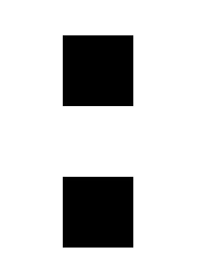
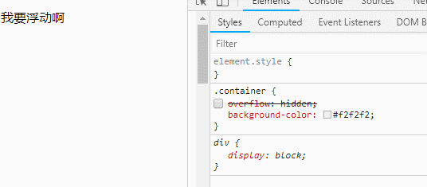
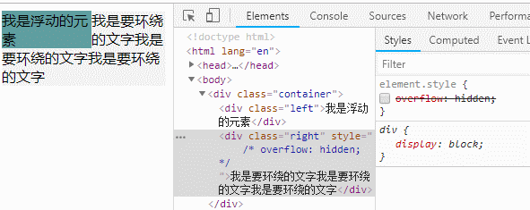

<a name="e4db8e92"></a>

## BFC 概念

BFC 是什么呢？

BFC 即 Block Formatting Contexts (块级格式化上下文)，它属于我们常说的普通流。

具有 BFC 特性的元素可以看作是隔离了的独立容器，容器里面的元素不会在布局上影响到外面的元素，并且 BFC 具有普通容器所没有的一些特性。 <a name="15245ae2"></a>

## 触发 BFC

只要元素满足下面任一条件即可触发 BFC 特性：

- 浮动元素：float 除 none 以外的值
- 绝对定位元素：position (absolute、fixed)
- display 为 inline-block、table-cells、flex
- overflow 除了 visible 以外的值 (hidden、auto、scroll)

<a name="76af9171"></a>

## BFC特性

<a name="cb95ed7b"></a>

#### 1.同一个 BFC 下，外边距会发生折叠

```html
<style>
div{
    width: 100px;
    height: 100px;
    background: black;
    margin: 100px;
}
</style>
<body>
    <div></div>
    <div></div>
</body>
```



从图上可以看出，因为两个 div 元素都处于同一个 BFC 容器下 (由 body 元素触发) 所以两个盒子之间距离只有 100px，而不是 200px。

**如何避免外边距的重叠。**

1. 使用pading或者透明border替换margin，或者竖直方向上采用同一方向margin。

2. 将其放在不同的 BFC 容器中。

```html
<head>
div{
    overflow:hidden;
}
p{
    width: 100px;
    height: 100px;
    background: black;
    margin: 100px;
}
</head>
<body>
    <div>
          <p></p>
    </div>
    <div>
          <p></p>
    </div>
</body>
```


<a name="b2acacd3"></a>

#### 2. BFC 可以包含浮动的元素（清除浮动）

浮动的元素，会脱离普通文档流，导致一个问题就是，撑不开容器的高度。

清除浮动的方法很多，overflow:hidden也可以清除浮动。其实就是因为，这个属性触发了BFC。而BFC是能包含浮动元素的。且与外部容器隔离开，这样就做到了清除浮动的效果。



<a name="670f1623"></a>

#### 3. BFC 可以阻止元素被浮动元素覆盖




这种方法可以用来做两列自适应。
