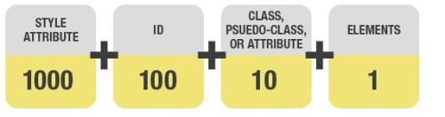

## 选择器的种类

- !important;（覆盖所有样式）
- 行内样式;
- id选择器;
- class,属性选择器（a\[href]）和伪类选择器（a:hover）;
- 标签选择器和伪元素选择器（:before）;

除开important，从上到小优先级依次减小，也就是权重变低。 

## 广为流传的计算权重的方法

如上图所示，根据选择器类型不同，给出了不同的权重值。

- STYLE：1000
- \#ID：100
- .CLASS 10
- ELEMENT 1

网上大多是文章把规则规定为：内联样式的权重值是1000，ID选择器的权重值是100，class选择器的权重值是10，标签选择器的权重值是1. 整条规则中的所有选择器权重值相加得到整个样式规则的权重值，数字越大权重值越高。

在大多数情况下这种说法的确是正确的。举一个特殊的例子。

    css如下：

    div div div div div div div div div div div{ background-color: red; }

    .wrapper{ background-color: black; }

    html 结构 

    11个层级的div 最后一个div上有class=“wrapper”

按照上面的规则，11个div 就是 11\_1 = 11，一个class 就是 1\_10 = 10。11>10,所以背景色应该是**红色**才对。而实际上是**黑色**。

## 权重比较的方法

如图所示，选择器的确划分为了四个层级，A,B,C,D，但并不是四个层级相加得总和然后再比较，而是根据权重从高到低，依次比较。

#### 比较规则：

    样式1 -> A = 样式2 -> A    //相等则比较下一层级

    样式1 -> B = 样式2 -> B    //相等则比较下一层级  

    样式1 -> C = 样式2 -> C    //相等则比较下一层级

    样式1 -> D = 样式2 -> D    //相等,无下一层级，则后定义的优先

#### 重新比较权重：

样式1： 0,0,0,11

样式2： 0,0,10,0

开始比较

    样式1 -> A **=** 样式2 -> A    //相等则比较下一层级

    样式1 -> B **=** 样式2 -> B    //相等则比较下一层级  

    样式1 -> C **<** 样式2 -> C    //样式2大于样式1，运用样式2的值。
