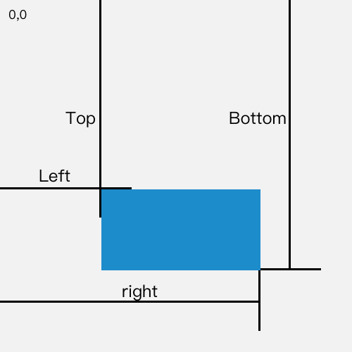

### 事件传递的方向

**冒泡阶段 和 捕获阶段**

事件最开始由window接收到，从顶层往下传递，一层一层直到传递到事件的触发元素，这一阶段称之为捕获阶段。

然后从子元素开始冒泡事件，然后传递给父元素，一层一层往外传。传回到window,这一阶段称之为冒泡阶段。

添加事件监听的方法 `addEventListener` ，其中有一个函数签名为

第三个参数就可以指定 在什么阶段处理该事件。
true 捕获阶段 false 冒泡阶段。
当没有传递该参数的时候，默认false。所以是在冒泡阶段处理事件的。

**阻止事件的传递 **

[`event.stopPropagation()`](https://developer.mozilla.org/zh-CN/docs/Web/API/Event/stopPropagation) 
阻止捕获和冒泡阶段中当前事件的进一步传播。
当你调用该函数过后，事件不再传递，不管是处于冒泡阶段还是捕获阶段。

[`event.stopImmediatePropagation()`](https://developer.mozilla.org/zh-CN/docs/Web/API/Event/stopImmediatePropagation)
阻止事件冒泡并且阻止相同事件的其他侦听器被调用。
效果和stopPropagation一样，然而还能阻止剩余相同事件的监听器的回调调用。

[`event.preventDefault`](https://developer.mozilla.org/zh-CN/docs/Web/API/Event/preventDefault)
如果此事件没有被显式处理，那么它默认的动作也不要做（因为默认是要做的）。此事件还是继续传播，除非碰到事件侦听器调用[stopPropagation()](https://developer.mozilla.org/zh-CN/docs/Web/API/Event/stopPropagation) 或[stopImmediatePropagation()](https://developer.mozilla.org/zh-CN/docs/Web/API/Event/stopImmediatePropagation)，才停止传播。

阻止默认动作，一些控件是有默认事件处理器的（如input\[type=checkbox],...），这个可以用来阻止默认事件。但不会影响事件传播。

### 事件的大体分类

#### windos事件

| 属性 | 值 | 描述 |
| :--- | :--- | :--- |
| [onafterprint](https://www.w3school.com.cn/tags/event_onafterprint.asp) | script | 文档打印之后运行的脚本。 |
| [onbeforeprint](https://www.w3school.com.cn/tags/event_onbeforeprint.asp) | script | 文档打印之前运行的脚本。 |
| onbeforeunload | script | 文档卸载之前运行的脚本。 |
| onerror | script | 在错误发生时运行的脚本。 |
| onhaschange | script | 当文档已改变时运行的脚本。 |
| [onload](https://www.w3school.com.cn/tags/event_onload.asp) | script | 页面结束加载之后触发。 |
| onmessage | script | 在消息被触发时运行的脚本。 |
| onoffline | script | 当文档离线时运行的脚本。 |
| ononline | script | 当文档上线时运行的脚本。 |
| onpagehide | script | 当窗口隐藏时运行的脚本。 |
| onpageshow | script | 当窗口成为可见时运行的脚本。 |
| onpopstate | script | 当窗口历史记录改变时运行的脚本。 |
| onredo | script | 当文档执行撤销（redo）时运行的脚本。 |
| [onresize](https://www.w3school.com.cn/tags/event_onresize.asp) | script | 当浏览器窗口被调整大小时触发。 |
| onstorage | script | 在 Web Storage 区域更新后运行的脚本。 |
| onundo | script | 在文档执行 undo 时运行的脚本。 |
| [onunload](https://www.w3school.com.cn/tags/event_onunload.asp) | script | 一旦页面已下载时触发（或者浏览器窗口已被关闭）。 |

#### form事件

| 属性 | 值 | 描述 |
| :--- | :--- | :--- |
| [onblur](https://www.w3school.com.cn/tags/event_onblur.asp) | script | 元素失去焦点时运行的脚本。 |
| [onchange](https://www.w3school.com.cn/tags/event_onchange.asp) | script | 在元素值被改变时运行的脚本。 |
| oncontextmenu | script | 当上下文菜单被触发时运行的脚本。 |
| [onfocus](https://www.w3school.com.cn/tags/event_onfocus.asp) | script | 当元素获得焦点时运行的脚本。 |
| onformchange | script | 在表单改变时运行的脚本。 |
| onforminput | script | 当表单获得用户输入时运行的脚本。 |
| oninput | script | 当元素获得用户输入时运行的脚本。 |
| oninvalid | script | 当元素无效时运行的脚本。 |
| onreset | script | 当表单中的重置按钮被点击时触发。HTML5 中不支持。 |
| [onselect](https://www.w3school.com.cn/tags/event_onselect.asp) | script | 在元素中文本被选中后触发。 |
| [onsubmit](https://www.w3school.com.cn/tags/event_onsubmit.asp) | script | 在提交表单时触发。 |

#### keyboard事件

| 属性 | 值 | 描述 |
| :--- | :--- | :--- |
| [onkeydown](https://www.w3school.com.cn/tags/event_onkeydown.asp) | script | 在用户按下按键时触发。 |
| [onkeypress](https://www.w3school.com.cn/tags/event_onkeypress.asp) | script | 在用户敲击按钮时触发。 |
| [onkeyup](https://www.w3school.com.cn/tags/event_onkeyup.asp) | script | 当用户释放按键时触发。 |

#### 鼠标事件

| 属性 | 值 | 描述 |
| :--- | :--- | :--- |
| [onclick](https://www.w3school.com.cn/tags/event_onclick.asp) | script | 元素上发生鼠标点击时触发。 |
| [ondblclick](https://www.w3school.com.cn/tags/event_ondblclick.asp) | script | 元素上发生鼠标双击时触发。 |
| ondrag | script | 元素被拖动时运行的脚本。 |
| ondragend | script | 在拖动操作末端运行的脚本。 |
| ondragenter | script | 当元素元素已被拖动到有效拖放区域时运行的脚本。 |
| ondragleave | script | 当元素离开有效拖放目标时运行的脚本。 |
| ondragover | script | 当元素在有效拖放目标上正在被拖动时运行的脚本。 |
| ondragstart | script | 在拖动操作开端运行的脚本。 |
| ondrop | script | 当被拖元素正在被拖放时运行的脚本。 |
| [onmousedown](https://www.w3school.com.cn/tags/event_onmousedown.asp) | script | 当元素上按下鼠标按钮时触发。 |
| [onmousemove](https://www.w3school.com.cn/tags/event_onmousemove.asp) | script | 当鼠标指针移动到元素上时触发。 |
| [onmouseout](https://www.w3school.com.cn/tags/event_onmouseout.asp) | script | 当鼠标指针移出元素时触发。 |
| [onmouseover](https://www.w3school.com.cn/tags/event_onmouseover.asp) | script | 当鼠标指针移动到元素上时触发。 |
| [onmouseup](https://www.w3school.com.cn/tags/event_onmouseup.asp) | script | 当在元素上释放鼠标按钮时触发。 |
| onmousewheel | script | 当鼠标滚轮正在被滚动时运行的脚本。 |
| onscroll | script | 当元素滚动条被滚动时运行的脚本。 |

### 事件涉及到的坐标体系

**鼠标事件中一些坐标**

鼠标事件中，传递给回调函数的参数是一个event。
有两个是常用的和坐标相关的属性。

event.clientX
event.clientY

解释摘自mdn。即这连个值是指浏览器可是区域的坐标。
`"clientX"`，`long` 型可选，默认为 `0`，设置鼠标事件时相对于客户端窗口的水平坐标位置；该操作并不会改变真实鼠标的位置。
`"clientY"`，`long` 型可选，默认为 `0`，设置鼠标事件时相对于客户端窗口的垂直坐标位置；该操作并不会改变真实鼠标的位置。

**dom元素中的一些坐标**

**Element.getBoundingClientRect()**
方法返回元素的大小及其相对于视口的位置

