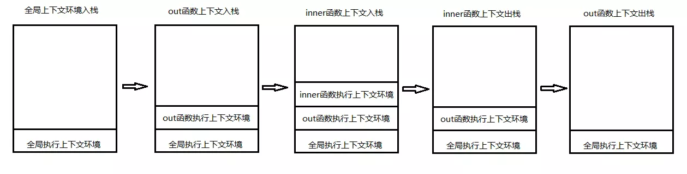
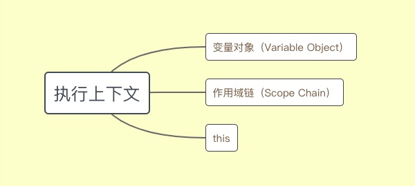
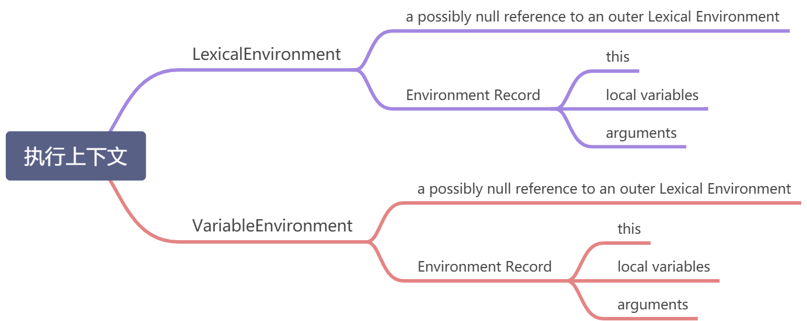

<a name="r5OpT"></a>

## 作用域（Scope）

> 作用域（scope，或译作有效范围）是名字（name）与实体（entity）的绑定（binding）保持有效的那部分计算机程序。（[维基百科](https://zh.wikipedia.org/wiki/%E4%BD%9C%E7%94%A8%E5%9F%9F)）
>
>
> Typically, scope is used to manage the visibility and accessibility of variables from different parts of a program.([链接](http://dmitrysoshnikov.com/ecmascript/es5-chapter-3-1-lexical-environments-common-theory/#scope))
>
>
> Scope is an enclosing context in which a variable is associated with a value.([链接](http://dmitrysoshnikov.com/ecmascript/es5-chapter-3-1-lexical-environments-common-theory/#scope))

简单点说，作用域限定了变量的寻址范围。

作用域还分动态作用域和静态作用域。具体区别参考[链接](JavaScript之作用域.md)。
JS采用的是静态作用域，也叫词法作用域。

JS里ES6之前，只有两种作用域，全局作用域，和函数作用域。

<a name="O50lt"></a>

### 全局作用域

全局作用域，声明的变量任何地方都可以访问得到。

<a name="CB8lj"></a>

### 函数作用域

顾名思义，定义一个函数就会生成函数作用域。在函数外部，是没法访问到，函数内部定义的变量的。

```javascript
function a (){
	var b = 'inner function!';
}

console.log(b);//ReferenceError
```

<a name="aSUqk"></a>

### 块级作用域

todo。

<a name="S1mEw"></a>

## 执行上下文（[Execution Contexts](https://www.ecma-international.org/ecma-262/11.0/index.html#sec-execution-contexts)）

可以简单理解为代码执行时所在的环境。具体到JS来说，一开始执行代码时，就有一个全局的执行上下文，然后是各个函数执行时，会生成新的执行上下文。ES使用  [`stack`](https://zh.wikipedia.org/wiki/%E5%A0%86%E6%A0%88) 管理这些执行上下文。

 另外值得一提的是，处于栈顶的执行上下文，称之为 `running execution context` ，即当前正在被执行的代码所属的上下文，同一时刻，有且只有一个 `running execution context  ` 。

看下面这段代码：

```javascript
var a = "coffe"; //1.进入全局执行上下文
function out() {
    var b = "18";
    function inner() {
        var c = "91";
        console.log(a+b+c);
    }
    inner(); //3.进入inner函数的执行上下文
}
out(); //2.进入out函数的执行上下文
```

1. 一开始执行，就有一个全局的执行上下文。
2. 调用out的时候，生成out函数的执行上下文。
3. out函数内部调用inner的时候，生成inner函数的执行上下文。
4. 当inner函数执行完，inner函数的执行上下文出栈。
5. 随后out函数执行完，out函数的执行上下文出栈。
6. 全局的执行上下文，会一直保持，直到整个JS脚本退出（标签页关闭）。



<a name="gDdJ1"></a>

### Execution Context的结构

emmmm，或许说到执行上下文，你听过vo(变量对象)，ao（激活对象），scope chain（作用域链）等概念。可能看起来就像下面这样



当执行上下文开始执行代码的时候，vo就变成ao了。没错我一直一来也是这么理解，因为网上大部分文章都这样说。直到有一天有位大佬给我说这些概念过时了。然后几番周折，我确认了的确过时了。而且过时很久了。自ES5的时候，标准已经没有上述概念了。

过程之中找到一些非常值得一读的文章，具体可以参考该文章<http://dmitrysoshnikov.com/>，是一些列解读JS内部实现的文章。

忽略其它我们不需要在意的，最新的结构如下：

其中 [`LexicalEnvironment` ](https://www.ecma-international.org/ecma-262/11.0/index.html#table-23)和 [`VariableEnvironment` ](https://www.ecma-international.org/ecma-262/11.0/index.html#table-23)都是一种叫 `[Lexical Environments](https://www.ecma-international.org/ecma-262/11.0/index.html#sec-lexical-environments)`  的类型。 （注意下类型的拼写和前面的是不同的，多了一个空格和s，被坑惨了）。

**为了避免混淆，下文都用简写 `LE` 代替 `Lexical Environments` 类型。**

如图所示 LE 由一个 `Environment Record` 和 一个指向外部 LE 的 引用（可能为null）构成。
`Environment Record`  则记录了出现在该上下文中所有变量的指向。（大概记录了 函数参数、函数内部声明的变量、this这几个东西）

至于[`LexicalEnvironment` ](https://www.ecma-international.org/ecma-262/11.0/index.html#table-23)和 [`VariableEnvironment` ](https://www.ecma-international.org/ecma-262/11.0/index.html#table-23)的差异，暂时不能确定。摘抄标准中的两段话：

> LexicalEnvironment，Identifies the [Lexical Environment](https://www.ecma-international.org/ecma-262/11.0/index.html#sec-lexical-environments) used to resolve identifier references made by code within this [execution context](https://www.ecma-international.org/ecma-262/11.0/index.html#sec-execution-contexts).
>
> VariableEnvironment，Identifies the [Lexical Environment](https://www.ecma-international.org/ecma-262/11.0/index.html#sec-lexical-environments) whose [EnvironmentRecord](https://www.ecma-international.org/ecma-262/11.0/index.html#sec-lexical-environments) holds bindings created by [VariableStatement](https://www.ecma-international.org/ecma-262/11.0/index.html#prod-VariableStatement)s within this [execution context](https://www.ecma-international.org/ecma-262/11.0/index.html#sec-execution-contexts).

另外在[ECMA-262-5 in detail. Chapter 3.2. Lexical environments: ECMAScript implementation.](http://dmitrysoshnikov.com/ecmascript/es5-chapter-3-2-lexical-environments-ecmascript-implementation/#variable-environment)也提到了这两者之间的差异。

todo 弄明白两者之间的差异

<a name="hkakX"></a>

### Environment Record的类型

<a name="93Sdw"></a>

#### Declarative Environment Records

<a name="1LN1r"></a>

#### Object Environment Records

<a name="xIvk4"></a>

#### Function Environment Records

<a name="i51fx"></a>

#### Global Environment Records

<a name="IY7bn"></a>

#### Module Environment Records
