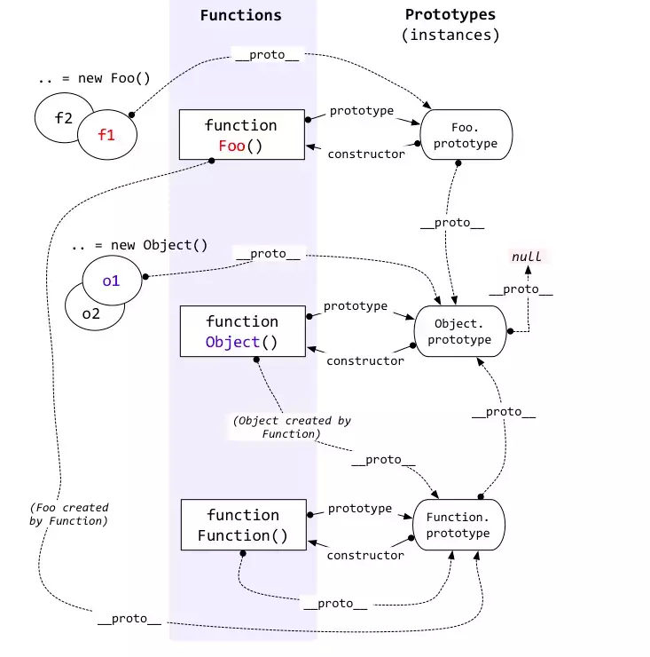

<a name="53582bdc"></a>

## 原型（prototype）是什么？

原型并不神秘，它实际也就是一个对象或者是null。

JavaScript里每个对象都有一个与之相关连的原型，你可以通过访问对象的`__proto__`属性，或者使用`Object.getPrototypeOf`来找到它。

你可以使用`Object.setPrototypeOf`显示去修改一个对象的原型指向。

但需要注意的是，原型有可能为不存在，即值为`null`，代表着这个对象没有原型了。

```javascript
//获取原型
const a = {};
a.__proto__ === Object.getPrototypeOf(a);

//修改原型指向
Object.setPrototypeOf(a,null);

//原型为 null
Object.__proto__.__proto__.__proto__ === null;

Object.getPrototypeOf(a) === null;
```

<a name="dp9QS"></a>

## 原型链是什么？

假设A对象的`__proto__`属性，指向的为B对象，则B对象就是A对象的原型。

B本身也是对象，则也拥有一个`__proto__`属性，指向另一个对象。

这样一层套一层，就形成了一个链条。直到原型链顶端`__proto__`属性指向`null`。原型链结束。

JS中原型默认指向`null`的对象为数不多，`Object.prototype`就是其中的一个，既`Object.prototype.__proto__ === null`。

<a name="66b6b632"></a>

## 原型指向是如何确定的？

`__proto__`指向的对象是如何确定的？

要确定这件事，我们得看看JavaScript里是怎么生成对象的：

<a name="9181f2f5"></a>

### 1.通过new操作符生成对象

JavaScript里new操作符，不过是使用特定的方式去调用一个函数。

JavaScript里通过new调用的函数，称之为构造函数。

JavaScript里函数都带有一个`prototype`属性，你可以随时更改它的指向。

JavaScript里函数默认的`prototype`属性，拥有一个`constructor`属性，指向函数自己。

通过new操作符调用构造函数，生成对象。该对象的**原型**指向了**构造函数的`prototype`属性**。

```javascript

function temp(){};

const a = new temp();

temp.prototype === a.__proto__;

temp.prototype.constructor === temp;
```

<a name="02c6fe0b"></a>

### 2.对象字面量

对象字面量即常用的写一对大括号，里面是key-value形式的键值对。该种方式声明对象的原型指向`Object.prototype`。

或者换种说法，字面量声明对象，默认是使用`Object`去构造的,即`new Object()`。

```javascript

a = { b:1 };

b = new Object();

a.__proto__ === b.__proto__

a.__proto__ === Object.prototype
```

<a name="d49ecf0a"></a>

### 3.使用Object.create创建对象

调用`Object.create`后会产生一个新的对象，传入`Object.create`的参数即为新对象的原型。

```javascript

a = { b:1 };

b = Object.create(a);

b.__proto__ === a;
```

总结一下，使用new调用构造函数生成新对象，新对象原型指向了构造函数的`prototype`属性、使用对象字面量的形式创建的对象，原型默认指向了`Object.prototype`、使用`Object.create`创建的对象的原型指向了你传入的第一个参数。

<a name="b5a146f5"></a>

## 一张关于原型的经典的图



这里存在一个的问题，众所周知JS里函数也是对象，那么函数是由谁构造的呢？那么函数的`__proto__`指向谁呢？

先看图中中间一部分，声明了三个函数，Foo函数，Object函数，Function函数。

然后从上到下一个一个说，

<a name="d2cb3dfb"></a>

### 1.Foo函数

Foo函数有它的`prototype`属性，且`prototype.constructor`指回了Foo函数本身。

f1/f2 是通过`new Foo()`生成的新对象，它俩的`__proto__`属性都指向了`Foo.prototype`。

`Foo.prototype`只是一个对象，所以它也有自己的原型，即`__proto__`属性，在你没修改情况下，指向了`Object.prototype`。

Foo函数本身也是一个对象，意味着它有自己的原型`__proto__`，指向了`Function.prototype`，这条线意味着，**函数都是通过内置的`Function`函数构造出来的**。

至此图中所有指向都明晰了。

<a name="e160e5ca"></a>

### 2.Object函数

Object函数基本上和Foo函数的指向是一样的，毕竟他们都是函数，只不过Object是内置的，Foo是你写的，还有一点不同在他们的`prototype`属性上。

Object函数有自己的`prototype`属性，且`prototype.constructor`指回了Object函数本身。

f1/f2 是通过`new Object()`生成的新对象，它俩的`__proto__`属性都指向了`Object.prototype`。

`Object.prototype`只是一个对象，所以它也有自己的原型，即`__proto__`属性，Object函数不同点就在于此，`Object.prototype.__proto__`值为`null`。即原型链在此终结。

Object函数本身也是一个对象，意味着它有自己的原型`__proto__`，指向了`Function.prototype`，这条线意味着，**函数都是通过内置的`Function`函数构造出来的**。

<a name="cf908962"></a>

### 3.Function函数

Function函数也是内置的，且所有函数都是通过它构造出来的，包括它自己。所以，你可以说，**默认情况下，所有函数的\_\_proto\_\_属性都指向Function.prototype**。

所以上图中，`Foo.__proto__`、`Object.__proto__`、`Function.__proto__` 都指向了`Function.prototype`。

其它指向不出其外。

Function函数有自己的`prototype`属性，且`prototype.constructor`指回了Function函数本身。

`Function.prototype`只是一个对象，所以它也有自己的原型，即`__proto__`属性，在你没修改情况下，指向了`Object.prototype`。
