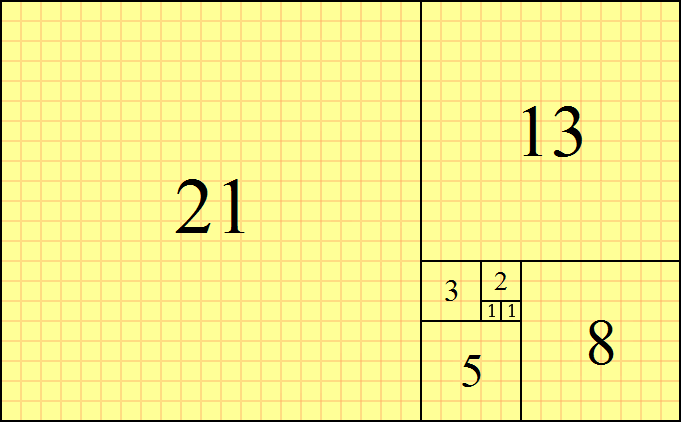
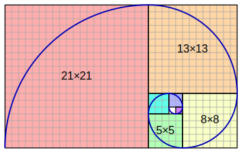

<a name="TauCK"></a>

## 定义

在数学中，斐波那契数是以下整数序列（称为斐波那契数列）中的数字，其特征在于前两个数字之后的每个数字都是前两个数字的和：

`0, 1, 1, 2, 3, 5, 8, 13, 21, 34, 55, 89, 144, ...`

边长为连续斐波纳契数的正方形平铺



斐波那契螺旋：通过绘制连接斐波那契平铺中正方形的相对角的圆弧而创建的金色螺旋的近似值； \[4]该三角形使用大小为1、1、2、3、5、8、13和21的正方形。



<a name="99r12"></a>

## 代码实现

```javascript
//时间复杂度为O(n)

const fibonacci = (n)=>{
  const fibSequence = [1];

  let currentValue = 1;
  let previousValue = 0;

  if (n === 1) {
    return fibSequence;
  }

  let iterationsCounter = n - 1;

  while (iterationsCounter) {
		//let now = previousValue + currentValue;
  	//previousValue = currentValue;
  	//currentValue = now;
    currentValue += previousValue;
    previousValue = currentValue - previousValue;
    
    fibSequence.push(currentValue);

    iterationsCounter -= 1;
  }

  return fibSequence;
}

```

<a name="References"></a>

## References

- [Wikipedia](https://en.wikipedia.org/wiki/Fibonacci_number)
