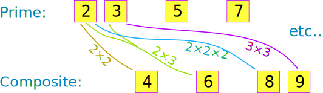
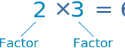

<a name="C36aa"></a>

## 定义

**质数** 是一个比 `1` 大的整数，且 **不能**由其它整数相乘得出。前几个质数是: `2`, `3`, `5`, `7`, `11`, `13`, `17`, `19`,依此类推。

如果我们**能**通过其它整数相乘得出，我们则称它为**合数**



*Image source: [Math is Fun](https://www.mathsisfun.com/prime-factorization.html)*

**质数因子**是那些相乘得到原始数的[质数](https://en.wikipedia.org/wiki/Prime_number)。例如`39`的质数因子是`3`和`13`，`15`的质数因子是`3`和`5`。



*Image source: [Math is Fun](https://www.mathsisfun.com/prime-factorization.html)*

<a name="2fa66895"></a>

## 正确计算所有的质数因子及其数量

这个方法将自然数`n`从`i = 2`除到`i = n`（仅按质数索引）。且每次循环后`n`的值被`(n / i)`的值替换。

在最坏的情况下，即循环从`i = 2`执行到 `i = n`，上述方法的时间复杂度为`O(n)`。时间复杂度其实可以从`O(n)`减少到`O(sqrt(n))`，通过减少循环的执行次数，从`i = 2`执行到 `i = sqrt(n)`。因为可以确认，当`i`大于`sqrt(n)`时，除了`n`本身，再没有数可以被整除了。

```javascript
const primeFactors = (n)=>{
  let nn = n;
  const factors = [];
  for (let factor = 2; factor <= Math.sqrt(nn); factor += 1) {
    while (nn % factor === 0) {
      nn /= factor;
      factors.push(factor);
    }
  }

  if (nn !== 1) {
    factors.push(nn);
  }

  return factors;
}
```

<a name="9bef63f9"></a>

## Hardy-Ramanujan公式用于计算质数因子的个数

1917年，G.H Hardy和Srinivasa Ramanujan提出了一个定理，该定理指出，自然数 `n` 的不同素数的数 `ω(n)` 的正态次序是`log(log(n))`。
粗略地讲，这意味着大多数数字具有这个数量的质数因子。

```javascript
const hardyRamanujan = (n) => {
  return Math.log(Math.log(n));
}
```

<a name="References"></a>

## References

- [Prime numbers on Math is Fun](https://www.mathsisfun.com/prime-factorization.html)
- [Prime numbers on Wikipedia](https://en.wikipedia.org/wiki/Prime_number)
- [Hardy–Ramanujan theorem on Wikipedia](https://en.wikipedia.org/wiki/Hardy%E2%80%93Ramanujan_theorem)
- [Prime factorization of a number on Youtube](https://www.youtube.com/watch?v=6PDtgHhpCHo\&list=PLLXdhg_r2hKA7DPDsunoDZ-Z769jWn4R8\&index=82)
