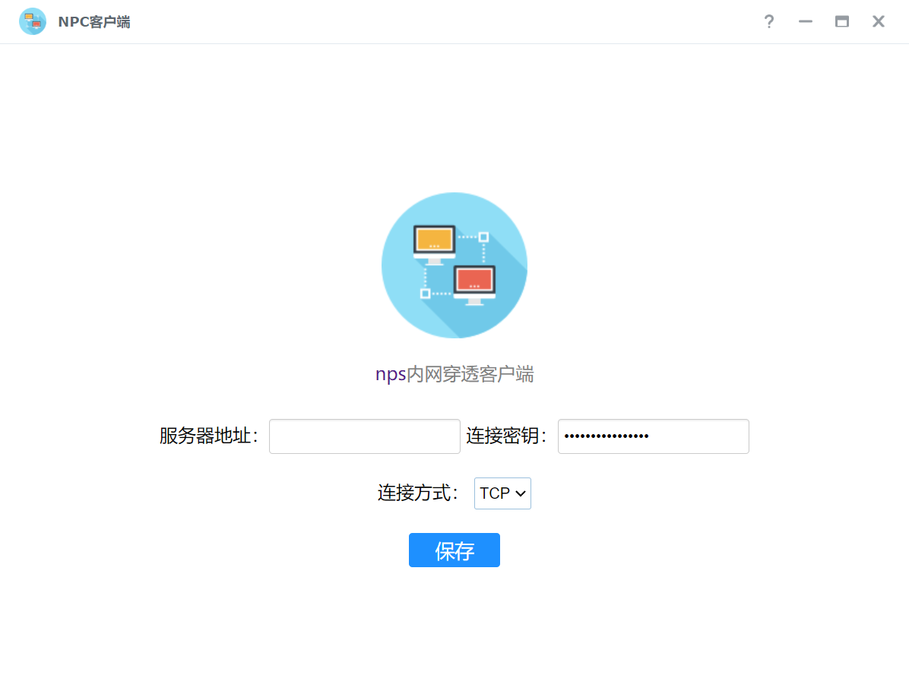
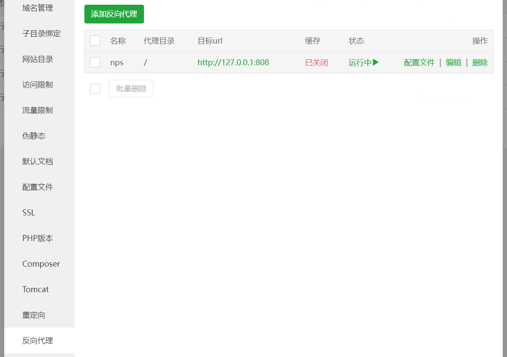
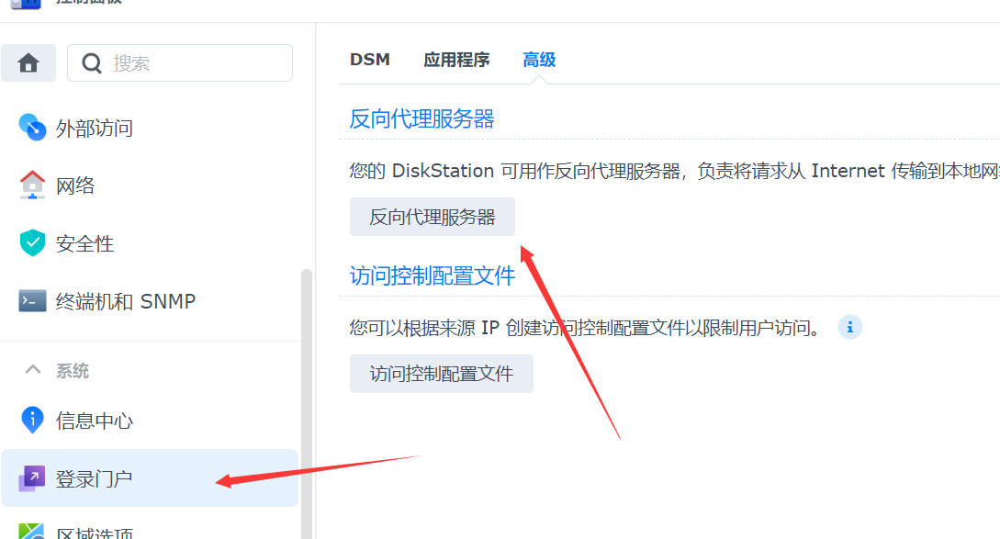
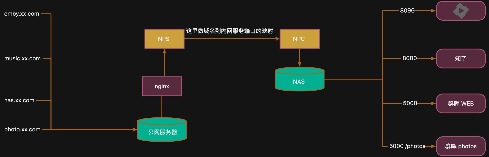

<a name="uODQo"></a>

## 前言

之前入手了台黑群晖 NAS ，折腾了一段时间，影视/相册/音乐都搭建好了服务，还有 docker 可以尝试各种服务，家里内网下使用还是很爽的，至少没了烦人的广告了。现在想在外网也能使用某些 NAS 上的服务，然后就折腾起了内网穿透这一块的东西。

折腾过程如下：

1. **公网 IP :** 要暴露到公网去，你就得需要一个公网的 IP ，但普通家庭宽带肯定是没有的，你可以去试着申请，不过希望不大。
2. **群晖 Connect 应用 : **但我的是黑群晖，就直接放弃了，而且这东西只针对群晖系列的应用，网速也不快。
3. **花生壳 : **花生壳可以直接在群晖套件中心中找到，点一下，外网就可以访问到群晖的 web 管理端了。但额外的端口，需要收费，带宽也是额外计费的，总之很麻烦。
4. **NPS : **其实最后想明白了，我需要的只是一个公网 IP 而已，云服务器都有的，在最后 Google 的帮助下，找到了 **NPS **这个软件，它能把云服务器和家里 NAS 连接起来，端口数量没有限制，网速则取决于你家里的带宽和服务器的带宽。

<a name="L3fRa"></a>

## [NPS](https://ehang-io.github.io/nps/#/) 部署步骤

**准备**：你首先得准备好外网的一台云服务器/内网的一个正常运行的 NAS。
**需要注意的点**：**NPS** 服务端默认会占据好几个端口(80/443/8080/8024)，其它几个端口都可以先不管，但我服务器上装了宝塔面板，已经把80/443端口占了。所以需要在配置文件里把这两个端口改一下(808/4438)。然后再用 Nginx 反向代理域名到(808/4438)端口上。

<a name="hLuaN"></a>

### 安装 NPS

在 Github 上找到适合你系统的最新的 Release 文件

```bash
wget https://github.com/ehang-io/nps/releases/download/v0.26.10/linux_386_server.tar.gz

tar -zxvf linux_386_server.tar.gz

./nps install

## 配置文件在 /etc/nps/conf/nps.conf 下，可以去这改端口和web端的账户密码
## vi /etc/nps/conf/nps.conf

nps start
```

执行完上面的操作后，就可以使用 ip:8080 去访问 web 端管理。
第一步需要创建一个客户端。把客户端的连接密钥记住。

然后就是客户端的操作，在群晖套件中心找到 npc 套件。如下图：


服务器地址填 ip:8024 连接密钥是创建客户端那里那个。填上保存就行。
然后需要做的就是，配置转发规则，哪个域名到内网那个端口上。配置好了就行。

<a name="Xe9ow"></a>

### Nginx 转发

你要是熟悉 Nginx ，直接写配置文件就行了。只要把你需要转发那几个域名到 808/4438 端口就行了。
我是使用的宝塔面板，新建静态网站，然后在设置->反向代理，添加反向代理，如下图：



<a name="v5jtP"></a>

## 内网域名解析

当使用域名过后，在家里会有一个问题，家里访问的时候，也会走外网去绕一圈，影响网速不说，还要跑服务器流量，国内服务器流量和带宽都很贵的。所以还需要在家里的路由器配置个 hosts，一般路由器都有自定义 hosts 功能。百度一下应该就能找到。把那几个域名设置到内网的群晖机器 IP 上。

剩下一个问题是，自定义 hosts 只能转发到 80 端口，所以最后还要在群晖上配一个反向代理，把不同的域名转发到不同的端口上。


<a name="NS1UZ"></a>

## NAS网络示意图


