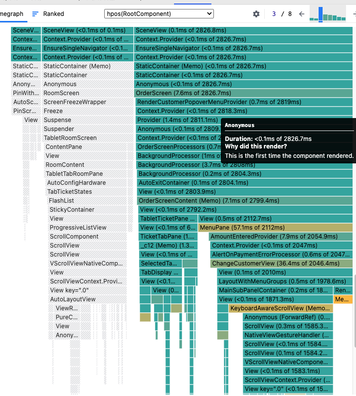

## 简单回顾一下 React 是如何工作的

React 的工作原理可以用这个表达式描述：`UI = FN(State)`。我们定义 State，React 将其转换为 UI。

每当 State 变化时，React 会重新执行这个函数。FN 包含了我们编写的所有组件，每次执行时会依次调用各组件的 render 函数。

为了避免混淆，需要明确两个概念：

1. **React Rerender**：State 变化导致 React 执行 FN 函数的过程
2. **Component Rerender**：FN 执行期间，某个组件执行了自己的 render 函数

这两者的区别在 React DevTools 的 Profile 中很明显：右上角显示 React Rerender 次数，下方显示该次 rerender 中哪些组件重新渲染了。



严格按照 `UI = FN(State)` 执行的话，每次 React Rerender 都会触发所有组件 rerender。但这在大型项目中存在性能问题，因此 React 有两个默认的规则：

1. **组件标记机制**：组件调用 setState 时会被标记为"待更新"，React Rerender 时只执行有标记组件的 render 函数，无标记的组件直接复用上次结果
2. **父子联动规则**：父组件 rerender 时，所有子组件默认也会 rerender，无论是否有标记

[demo zip](/public/sharing-demo.zip) _参考 src/demo1/demo1.tsx_


## 如何触发 React Rerender？

常见的误解是"state/props/context 变化时会触发 Rerender"。但这个答案并不准确。

看下面这个例子：

```tsx
const global = { backgroundColor: "#fff" };
const CompD = (props) => {
  const { color } = props;
  return <Card style={{ backgroundColor: color }} />;
};
const App = () => {
  const changeColor = () => {
    global.backgroundColor = "#000";
  };
  return (
    <>
      <CompD color={global.backgroundColor} />
      <Button onClick={changeColor}>change color</Button>
    </>
  );
};
```

_参考 src/demo1/demo1.tsx -> ChildD_

点击 button，会触发 React Rerender 吗？CompD 会 Rerender 吗？Card 的背景颜色会改变吗？

**答案是不会**，因为点击 button 只改变了数据，但没有通知 React 进行 render。既然没有触发 React Rerender，自然也不会有任何 Component Rerender。

再看 state 变化的情况。state 的最大不同是修改方式被限制了，你只能通过 setState 进行修改：

```tsx
const CompD = (props) => {
  const { color } = props;
  return <Card style={{ backgroundColor: color }} />;
};

const App = () => {
  const [backgroundColor, setColor] = useState("#fff");
  const changeColor = () => {
    setColor("#000");
  };
  return (
    <>
      <CompD color={backgroundColor} />
      <Button onClick={changeColor}>change color</Button>
    </>
  );
};
```

这次点击 button 就会改变背景颜色。关键区别在于 **setState 有两个职责**：

1. 修改数据
2. 通知 React 进行 Rerender [源码参考](https://github.com/facebook/react/blob/6b7e207cabe4c1bc9390d862dd9228e94e9edf4b/packages/react-reconciler/src/ReactFiberHooks.js#L3674)

更准确地说，props/context 只是组件间传递值的工具。说"props 发生改变"，实际是指传递给 props 的值发生改变，关键在于这个值是 React 内部的 state 还是外部的 state。内部 state 改变时会通知 React 进行 render，外部 state 则不会。

### 小结

**触发 React Rerender 的方式：**

1. useState/useReducer 提供的 setState/dispatch 方法
2. class 组件的 forceUpdate 方法
3. useSyncExternalStore

**props 和 context 是在 React rerender 过程中，判断组件是否需要 rerender 的条件。**

**判断 Component 是否需要 Rerender 的条件：**

1. props change
2. context change
3. 父组件是否渲染
4. 是否使用 Memo/PureComponent

## 第三方状态管理库如何工作？怎么触发 React Rerender？

以 Redux/React-Redux 为例，虽然第三方状态管理库很多，但原理基本相同。

第三方 store 本质上类似于全局变量。回到之前的例子：

```tsx
const global = { backgroundColor: "#fff" };
const CompD = (props) => {
  const { color } = props;
  return <Card style={{ backgroundColor: color }} />;
};
const App = () => {
  const changeColor = () => {
    global.backgroundColor = "#000";
  };
  return (
    <>
      <CompD color={global.backgroundColor} />
      <Button onClick={changeColor}>change color</Button>
    </>
  );
};
```

如何让组件能响应全局变量的变化？有两种方案：

### 方案一：手动通知 React

```tsx
const global = { backgroundColor: "#fff" };
const CompD = (props) => {
  const { color } = props;
  return <Card style={{ backgroundColor: color }} />;
};
const App = () => {
  const [_, setState] = useState(0);
  const changeColor = () => {
    global.backgroundColor = "#000";
    // 借用 state change ，通知 React 更新
    setState((x) => x + 1);
  };
  return (
    <>
      <CompD color={global.backgroundColor} />
      <Button onClick={changeColor}>change color</Button>
    </>
  );
};
```

这种方式的缺陷是：全局变量可能被 React 外部修改，无法触发组件更新。

### 方案二：订阅模式

```ts
const globalState = { backgroundColor: "#fff" };
const globalStore = {
  state: globalState,
  listeners: [] as Listener[],
  subscribe: (callback: Listener) => {
    globalStore.listeners.push(callback);
    return () => {
      globalStore.listeners = globalStore.listeners.filter((l) => l !== callback);
    };
  },
  notify: () => {
    globalStore.listeners.forEach((l) => l());
  },
  set: (modifyState: () => void) => {
    modifyState();
    globalStore.notify();
  },
};
```

使用时：

```tsx
const CompD = (props) => {
  const { color } = props;
  return <Card style={{ backgroundColor: color }} />;
};

const useSelectorVersion1 = () => {
  const [, forceRender] = useReducer((s) => s + 1, 0);
  useEffect(() => {
    const unSubscribe = globalStore.subscribe(forceRender);
    return unSubscribe;
  }, []);
};

const App = () => {
  useSelectorVersion1();
  const changeColor = () => {
    globalStore.set("#000");
  };
  return (
    <>
      <CompD color={globalStore.state.backgroundColor} />
      <Button onClick={changeColor}>change color</Button>
    </>
  );
};
```

_参考 src/demo1/demo2.tsx -> useSelectorVersion1_

这个改造后的 store 已经具备了 Redux 的[核心能力](https://cn.redux.js.org/api/store#store-%E6%96%B9%E6%B3%95)：

1. 提供订阅机制
2. 限制数据修改方式

### Redux 与 React-Redux 的关系

Redux 本身很简单：一个增强版的全局变量，提供订阅能力并严格限制数据修改方式。它并非专为 React 设计，可以用于任何框架。

真正连接 Redux 和 React 的是 **React-Redux**，它解决了一个关键问题：**颗粒度**。

直接使用 Redux 时，store 中任何状态变化都会触发所有订阅组件重新渲染，即使组件不关心这个状态。这在大型项目中会造成严重的性能问题。

React-Redux 通过 **Selector** 概念解决了这个问题。Selector 从全量 store 中选取特定数据，只有选中的数据变化时才触发组件更新。

### useSelector 的简化实现

useSelector 的源码参考：[useSelector-7.2.9](https://github.com/reduxjs/react-redux/blob/49f768082e5c56930e943a3a9b0a60249bce1914/src/hooks/useSelector.js#L92) 这个版本的还是使用 setState 去通知 React Rerender 的，在之后的版本已经开始使用 [useSyncExternalStore](https://github.com/reduxjs/react-redux/blob/v9.1.2/src/hooks/useSelector.ts#L249) 了。

简化实现如下：

```tsx
const useSelector = <T,>(selector: (state: GlobalState) => T) => {
  const [, forceRender] = useReducer((s) => s + 1, 0);
  const latestSelected = useRef<T>(selector(globalStore.state));

  useEffect(() => {
    const checkForUpdates = () => {
      const newSelected = selector(globalStore.state);
      // 只有选中的数据发生变化才触发重渲染
      if (newSelected !== latestSelected.current) {
        latestSelected.current = newSelected;
        forceRender();
      }
    };

    const unSubscribe = globalStore.subscribe(checkForUpdates);
    return unSubscribe;
  }, []);

  return selector(globalStore.state);
};
```

_参考 src/demo1/demo2.tsx -> useSelectorVersion3_

### 核心要点

1. **Redux 本质**：增强版全局变量，提供订阅能力和严格的数据修改限制
2. **第三方状态管理的通知机制**：最终都是通过 setState/forceUpdate/useSyncExternalStore 通知 React
3. **Selector 函数要简洁**：只做数据选取，不做转换、派生或默认值处理
4. **useSelector 的默认比较**：使用 `===` 进行浅比较
5. **useSelector 的职责**：
   - 订阅/取消订阅 store 变化
   - 执行 selector 函数并比较结果
   - 必要时借助 setState 触发组件重渲染

## React 18 为什么推出 useSyncExternalStore

React 18 引入了 [useSyncExternalStore](https://react.dev/reference/react/useSyncExternalStore) 这个 hook，专门用于订阅外部 store。

### 问题背景：State Tearing

这个 hook 的出现是为了解决 React Fiber 架构带来的新问题：**State Tearing**。

Fiber 架构让 React 从同步渲染变为并发渲染，即渲染过程可以被中断。具体来说：

- **之前**：一口气遍历完整个组件树
- **现在**：时间分片处理，每处理完一个组件节点检查剩余时间，超时就让出控制权给浏览器

### State Tearing 是什么

由于 React 在渲染过程中会让出 JS 控制权，React 外部的 JS 可能会修改第三方 Store 的数据，导致不一致的 UI。

举个例子：

```
初始状态：count = 1
A 组件开始渲染，读取 count = 1
React 让出控制权
外部 JS 修改 count = 2
B 组件开始渲染，读取 count = 2

结果：A 显示 1，B 显示 2 （应该显示相同值）
```

#### Synchronous rendering


#### Concurrent rendering


### 解决方案

`useSyncExternalStore` 的解决策略很简单：检测到 State Tearing 时，直接回退到同步渲染模式。

```ts
// React 源码片段
if (renderWasConcurrent && !isRenderConsistentWithExternalStores(finishedWork)) {
  // 检测到外部 store 数据不一致，回退到同步渲染
  exitStatus = renderRootSync(root, lanes, false);
  renderWasConcurrent = false;
}
```

参考代码[how uSES solve the tearing](http://github.com/facebook/react/blob/e1dc03492eedaec517e14a6e32b8fda571d00767/packages/react-reconciler/src/ReactFiberWorkLoop.js#L1114)


note：关于 `useSyncExternalStore` 的[最新消息](https://react.dev/blog/2025/04/23/react-labs-view-transitions-activity-and-more#concurrent-stores)

_演示Demo src/demo1/demo2.tsx -> useSelectorVersion1_


## 项目里使用过的优化手段

1. selector must be simple

```ts
const data = useSelector(state =>{
 // ❌ 返回新对象
 return { user : state.user };
 // ❌ 派生新数据
 return state.posts.filter(p=>p.id === "id");
 // ❌ 返回的默认值为新对象
 return state.user || {};
 // ✅ 直接 pick 部分数据返回，不做任何操作
 return state.user;
};

```

3. batch actions

```ts
// ❌ 多次 dispatch 造成多次 rerender
dispatch(actionA());  // render A
dispatch(actionB());  // render B
dispatch(actionC());  // render C
// ✅ 使用 batch 合并为一次 rerender
runInBatch(() => {
  dispatch(action1());
  dispatch(action2());
  dispatch(action3()); // render A B C
});
```

2. meaningless useSelector call

```tsx
// 组件渲染并不需要使用 data 但仍然订阅
const SomeComponent = () => {
  const data = useSelector((state) => state.someData);

  const handleOnClick = () => {
    // 使用了 data
    doSomethingWithData(data);
  };
  return <div onclick={handleOnClick}>Static content</div>;
};
```

4. do less things

```tsx {*}{maxHeight: '195px'}
// ❌ 列表 Item 里订阅同一个数据
const Item = ()=>{
    const data = useSelector(s=>s.user);
    return <div>{data}</div>
};
const App = ()=>{
    const list = [1,2,3,4,5,6];
    return list.map(i=><Item/>);
}; 

// ✅ Parent订阅该数据，通过 props 传递
const Item = ({ data })=>{
    return <div>{data}</div>
};
const App = ()=>{
    const data = useSelector(s=>s.user);
    const list = [1,2,3,4,5,6];
    return list.map(i=><Item data={data}/>);
}; 
```


