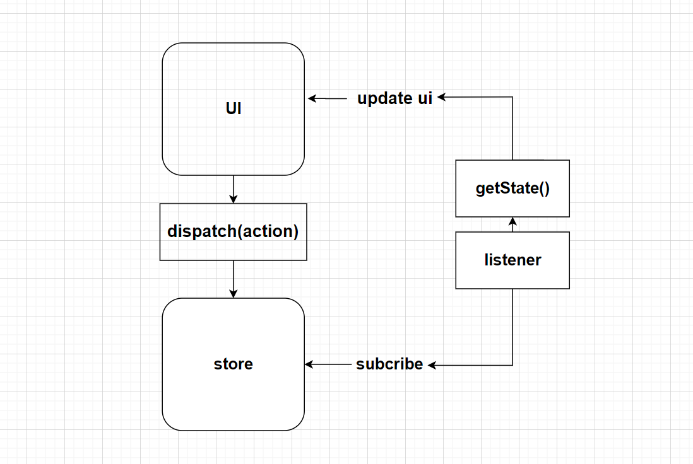
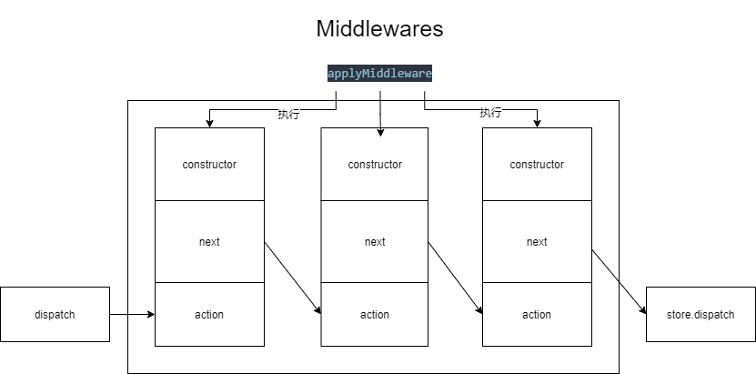

<a name="1OYaY"></a>

## 基本使用

基本使用一般有以下几个步骤：

1. 使用createStore创建一个store
2. 使用subscribe订阅store的更新
3. 在订阅更新的callback中：

a. 使用getState获取当前state
b. 从完整的state中取出当前UI需要的数据
c. 使用取到的数据更新UI

4. 如果必要，初始化的时候使用initialState更新UI
5. 派发Redux Action来响应UI的输入

抛开其它暂时不管，只关心核心的store，最基础的实现：

一个store用来储存数据。
一个listeners数组，用来储存订阅的回调。
一个getState来获取当前数据。
一个dispatch来派发action，到reducer进行数据更新，并通知到所有订阅了的listener。

```javascript
function createStore(reducer) {
    var state;
    var listeners = []

    function getState() {
        return state
    }
    
    function subscribe(listener) {
        listeners.push(listener)
        return function unsubscribe() {
            var index = listeners.indexOf(listener)
            listeners.splice(index, 1)
        }
    }
    
    function dispatch(action) {
        state = reducer(state, action)
        listeners.forEach(listener => listener())
    }

    dispatch({})

    return { dispatch, subscribe, getState }
}


//定义reducer
const reducer = (state,action)=>{
  const newState = {};
  // do sth with state and action;
  return newState;
}

//创建store
const store = createStore(reducer);
//订阅store更新
store.subscribe(()=>{
	const newState = store.getState();
  //update UI with newState
  
});

//UI输入时，派发Action
store.dispatch(someAction);
```

看完上面代码，有没有觉得其实Redux其实真的很简单。上面代码流程 大概是下面这样：


<a name="IObhM"></a>

## 逐渐复杂的Redux

redux基本理论确实简单，但Redux在这个基础上添加了许多东西。

<a name="F16Jh"></a>

### middleware

中间件算是一个，为了实现中间件，引入了两个API。 <a name="vD8Zt"></a>

#### [compose](https://redux.js.org/api/compose)

`compose`  这是一个工具函数，接收一个函数数组，并组合成一个函数，调用这个函数，从右到左调用数组里的函数，并且把右边函数的返回值作为左边函数的入参。还是看代码吧。

```javascript
const compose = (...funcs) => {
  if (funcs.length === 0) {
    return (arg) => arg;
  }

  if (funcs.length === 1) {
    return funcs[0];
  }

  return funcs.reduce((a, b) => (...args) => a(b(...args)));
};

// 使用
const fns = [1,2,3,4,5,6,7,8,9].map(i=>()=>console.log(i));
const fn = compose(...fns);
fn();

// 使用2
const fns2 = [1,2,3,4,5,6,7,8,9].map(i=>(input)=>{console.log(input);return input+i;});
const fn2 = compose(...fns2);
fn2(1000);

```

<a name="fOV7p"></a>

#### [applymiddleware](https://redux.js.org/api/applymiddleware)

`applyMiddleware` 这个就是实现中间件的函数了，其实背后还隐藏着一个[Store enhancer](https://redux.js.org/understanding/thinking-in-redux/glossary#store-enhancer)的概念，暂时先不管，先看看代码。

```javascript
const applyMiddleware = (...middlewares) => (createStore) => (reducer) => {
  // 构造一个用于构造中间的时候用的dispatch
  // 此处使用let，方便构造中间件过后，指向被中间件改造过的dispatch
  let dispatch = () => {
    throw new Error(
      "not allowd peform dispatch while constructing your middleware "
    );
  };
  // 这里创建store
  const store = createStore(reducer);
  // 提供给中间件的Api，注意一下此时dispatch的指向。
  const middlewareApi = {
    getState: store.getState,
    dispatch: dispatch,
  };
  // middlewares的函数标签如下
  // [(middlewareApi)=>(next)=>(action)=>{},...]
  
  // 构造所有中间件，chain是一个函数数组
  // [ fn1, fn2 ,fn3 ]
  // 函数标签如下
  // [ (next)=>(action)=>{},(next)=>(action)=>{},(next)=>(action)=>{} ]
  const chain = middlewares.map((middleware) => middleware(middlewareApi));
  
  // 使用compose组合所有中间件，并调用一次，传入真正的store.dispatch。
  // step1 compose(...chain), 组合了所有中间件，结果形如 
  // (arg)=>fn1(fn2(fn3(arg))) 
  // step2 compose(...chain)(store.dispatch)
  // 执行了上面那个函数，可以注意一下chain中函数的返回值,都是标签为 (action)=>{} 的函数
  
  // 所以其实左边函数的next就是右边函数返回的标签为(action)=>{}的函数
  // 有点绕,配合step1的结果看
  // (arg)=>fn1(fn2(fn3(arg)))
  // fn1 中的next 为fn2 返回的(action)=>{}
  // fn2 中的next 为fn3 返回的(action)=>{}
  // fn3 中的next 为arg 
  
  // 所以最后结果为：最左边的函数fn1的返回值(action)=>{}
  // 然后中间件要求，必须调用传入的next函数，并把action传递下去，（但并不保证是原始action）
  // 这样链条就形成了
  // fn1 的 (action)=>{} 先执行，并在其中调用了next，即
  // fn2 的 (action)=>{} 执行，并在其中调用了next，即
  // fn3 的 (action)=>{} 执行，并调用了next，即
  // arg 此时为真正的store.dispatch, 分发action到了store
  
  // 最后注意一下，dispatch的指向此时已经改变了
  dispatch = compose(...chain)(store.dispatch);
  
  return {
    ...store,
    dispatch,
  };
};
```

注释写的有点多，代码其实很简洁，只不过确实有点绕。

简单画了个图，将就看看：



简单来说，中间件是一个三阶函数（自己的叫法）像这样
`()=>()=>()=>{}` 。对应图中的constructor->next->action。
如果加上每一级的参数后，就像这样
`(middlewareApi)=>(next)=>(action)=>{}` 。

applyMiddleware，首先会执行constructor这层，让所有中间件只剩两层，即
`(next)=>(action)=>{}` 。
然后compose组合所有中间，连在一起，然后传入store.dispatch执行一次函数。形成最终的链条。

第一级的函数，作用相当于是，拿到`middlewareApi`去初始化中间件。
第二级的函数，在用compose组合函数过后，立即调用一次，从左到右确定了next的指向。
第三级的函数，接收action参数，并真正对action进行加工传递的地方。接着调用next，调用下一个中间件，至于传递的action是啥样的就看中间件是怎么 处理的了。

<a name="vyyaH"></a>

#### use

上面只是实现的原理，怎么用呢。

```javascript
// 看上面的函数签名，我们好像可以直接这样。
const store = applyMiddleware(midlleware1,midlleware2)(createStore)(reducer);

// 但官方的用法是这样的
const store = createStore(reducer,applyMiddleware(midlleware1,midlleware2))

```

和官方的使用方法还不一样，我们只有改改 `createStore` 了，忘记了长啥样的，建议先回去看看 `createStore` 的实现。更改过后最新代码如下：

```javascript
const createStore = (reducer,enhancer) => {

  // 这是新增的
  if( typeof enhancer === 'function'){
    return enhancer(createStore)(reducer);
  }

  var state;
  var listeners = [];

  function getState() {
    return state;
  }

  function subscribe(listener) {
    listeners.push(listener);
    return function unsubscribe() {
      var index = listeners.indexOf(listener);
      listeners.splice(index, 1);
    };
  }

  function dispatch(action) {
    state = reducer(state, action);
    listeners.forEach((listener) => listener());
  }

  dispatch({});

  return { dispatch, subscribe, getState };
}

const compose = (...funcs) => {
  if (funcs.length === 0) {
    return (arg) => arg;
  }

  if (funcs.length === 1) {
    return funcs[0];
  }

  return funcs.reduce((a, b) => (...args) => a(b(...args)));
};


// 加上新写的applyMidlleware
const applyMiddleware = (...middlewares) => (createStore) => (reducer) => {
  let dispatch = () => {
    throw new Error(
      "not allowd peform dispatch while constructing your middleware "
    );
  };
  
  const store = createStore(reducer);
  const middlewareApi = {
    getState: store.getState,
    dispatch: dispatch,
  };
  
  const chain = middlewares.map((middleware) => middleware(middlewareApi));
  
  dispatch = compose(...chain)(store.dispatch);
  
  return {
    ...store,
    dispatch,
  };
};

// 使用
const reducer = (state = 0, action) => {
  switch (action.type) {
    case "INCREMENT":
      return state + 1;
    case "DECREMENT":
      return state - 1;
    default:
      return state;
  }
};

// 日志中间件
const logger = param=>next => action => {
   console.log("will dispatch",action);
   const returnValue = next(action);
   return returnValue;
};
const store = createStore(reducer,applyMiddleware(logger));

store.subscribe(()=>{
    console.log("数据更改了：");
    console.log(store.getState());
});

store.dispatch({type : "INCREMENT"});
store.dispatch({type : "DECREMENT"});
```

<a name="gwDHf"></a>

### [combineReducers](https://redux.js.org/api/combinereducers)

随着应用程序变得越来越复杂，你可能需要将你的reducer分成几个独立的reducer，每个reducer都管理着store的独立部分。然后就需要用到今天的主角 `combineReducers` 了。
它会合并多个recuders，并生成一个reducer。当你传递action给这个reducer时，它会把action依次传递每个子reducer，并拿到返回的部分state，然后合并成最终的state。

<a name="4KRWN"></a>

#### 实现

其实也很简单， `combineReducers`  接收一个对象，对象的每个key就代表一个reducer，这个key值也就作为了store上的key，充当了命名空间。

抛开源码中的各种警告信息，源码大概如下。

```javascript
const combineReducers = (reducers)=>{

    const keys = Object.keys(reducers);
    const finalReducers = {};

    //下面这个for循环过滤 无效key，即不是function的key
    for(let i = 0; i<keys.length; i++){
        const key = keys[i];
        if(typeof reducers[key] === 'function'){
            finalReducers[key] = reducers[key];
        }
    }

    const finalReducerKeys = Object.keys(finalReducers);

    // 返回一个reducer
    return (state = {},action)=>{
        // 用来判断新生成的state是否发生改变。
        let hasChanged = false;
      	// 即将生成的state。
        const nextState = {};
      	// 下面这个for循环，遍历reducer，生成新state
        for(let i = 0; i<finalReducerKeys.length; i++){
          	// 取key
            const key = finalReducerKeys[i];
            // 取reducer
            const reducer = finalReducers[key];
            // 根据key 取旧state片段。
          	const prevStateForKey = state[key];
          	// 调用当前key对应的reducer，生成新state片段
            const nextStateForKey = reducer(prevStateForKey,action);
          	// reducer不能返回undefined，否则会抛错
            if(typeof nextStateForKey === 'undefined'){
                throw new Error('error')
            }
            // 将片段赋值给新state
            nextState[key] = nextStateForKey;
            // 对比该片段前后是否有更改，注意下怎么判断的。
            hasChanged = hasChanged || nextStateForKey !== prevStateForKey;
        }
      	// todo 对比state和reducers的长度来确定是否发生改变？
        hasChanged = hasChanged || finalReducerKeys.length !== Object.keys(state).length;
        return hasChanged ? nextState : state;
    }
};
```

<a name="TY2JT"></a>

#### 使用

```javascript
const counter = (state = 0, action) => {
  switch (action.type) {
    case "INCREMENT":
      return state + 1;
    case "DECREMENT":
      return state - 1;
    default:
      return state;
  }
};

const todos = (state = [], action) => {
  switch (action.type) {
    case 'ADD_TODO':
      return state.concat([action.text])
    default:
      return state
  }
};


const reducer = combineReducers({counter,todos});

const store = createStore(reducer);

store.subscribe(()=>{
    console.log("数据更改了：");
    console.log(store.getState());
});

store.dispatch({type : "INCREMENT"});
store.dispatch({type : "DECREMENT"});
store.dispatch({type : "ADD_TODO", text : "dadada"});
```

以上只是简单代码实现，基本是从源码中摘抄出来的，只稍作更改，如你所见，代码其实都很简单。

<a name="KH4D0"></a>

### 其它一些杂七杂八的

<a name="Hq2Y6"></a>

#### 对Action的要求

Action必须是个纯对象，且需要带有一个不为undefined的type属性。

<a name="mXR0U"></a>

#### 对Reudcer的要求

Reducer必须是个纯函数。

<a name="ukI5L"></a>

#### 中间件可以简单，也可以很复杂

中间件其实就是把UI上触发的action，拦截下来了，自己处理，不管在中间件里怎么折腾，只要最后给Store的Action是纯对象就行。

[redux-thunk](https://github.com/reduxjs/redux-thunk) ，就是特别简单的一个，简单判断了下action是否是函数，是函数就调用，不是就传递Action。
代码如下：

```javascript
const ({ dispatch, getState }) => (next) => (action) => {
    if (typeof action === 'function') {
      return action(dispatch, getState);
    }
    return next(action);
 };
```

相较之下，[redux-saga](https://github.com/redux-saga/redux-saga) 和 [redux-observable](https://github.com/redux-observable/redux-observable)就复杂太多了。
redux-saga里面使用generator语法。redux-observable里引入了rxjs的概念。
说实在的这两在处理复杂数据流的时候，都很有优势。但也都很复杂。
但大部分时间，普通前端搬砖过程中，都遇不到这么复杂的数据流，所以我不太喜欢这两个东西。

以上代码的综合版本[链接](https://github.com/CodeByZack/mock-redux)。

-网上觉得很有意思的观点-
Store 扁平化有很大原因是 js 对 immutable 支持力度不够，导致对深层数据修改非常麻烦导致的。 <a name="KmQbH"></a>

####
