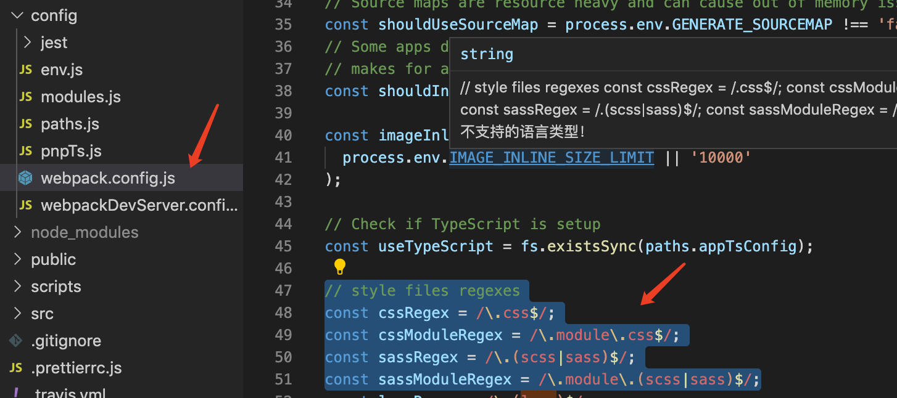
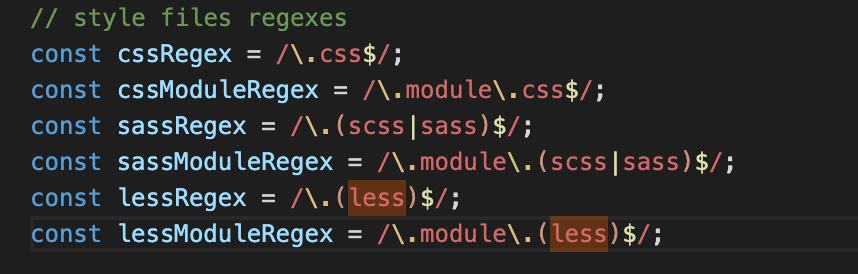
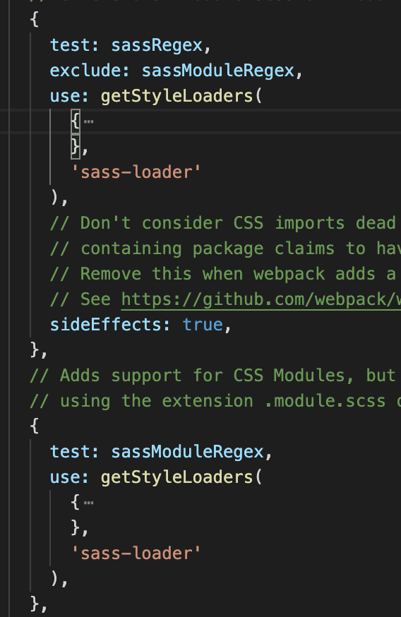
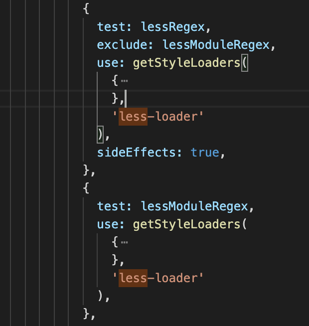
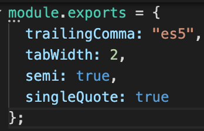
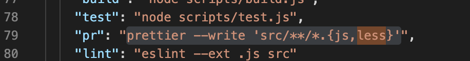
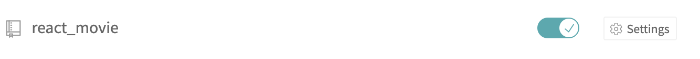
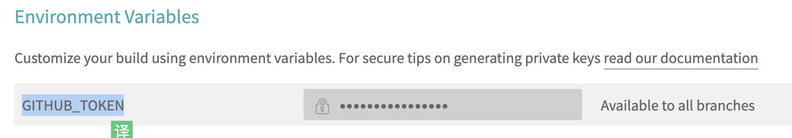
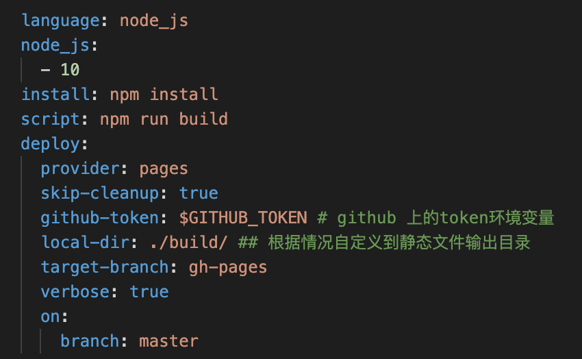

<a name="4A3d4"></a>

## 1.create-react-app不支持less

执行npm run eject
找到./config/webpack.config.js（找不到请全局搜索sass）
然后你会找到下图


默认是没有less的，手动加上。


继续搜索sass，你会找到下面这个，然后cv一顿操作，变成右边这样。

然后装下 less  和 less-loader,重启项目完事。 

<a name="Mr931"></a>

## 2.prettier使用

用这个主要是因为自己tab一会2格一会4格的。这个简单。用这些工具，主要是记住配置文件在哪,还有优先顺序。
具体可看[prettier config](https://prettier.io/docs/en/configuration.html)，以下为常用的两个地方。
1.prettier会读取package.json下面的prettier。
2.prettier会读取根目录下的.prettierrc.js

具体配置项，见官方文档[prettier option](https://prettier.io/docs/en/options.html),我的配置如下。


执行的话，只是项目里装了prettier 
npx prettier src/**/*.{js,less} --write
全局装prettier可以去掉npx，--write是为了直接写入文件，src/**/*.{js,less}不知道是什么语法，但最后肯定是后缀，中间那几个星号貌似是遍历文件夹的。
一般这个写到package.json里scripts下。
 <a name="Oi228"></a>

##

<a name="AFTE7"></a>

## 3.[travis-ci](https://travis-ci.org/)的使用

我也是第一次用这个，先说说这个是干嘛的。
现在的前端项目基本上都是，有依赖，开发完还需要build一下。代码仓库里存的都是你自己写的代码，没有存依赖项（node-modules），存的代码也不是直接能发布到对外的web服务器上的。所以我以前自己发布一个项目的时候，是这样的。

1.开发完，本地测试好了，npm run build， 把打包后的文件一起传到代码仓库。
2.ssh连上服务器，进入你的发布目录。
3.git pull 项目。

4.修改功能时，本地测试好，build，上传。
5.ssh连上服务器，进入你的发布目录。
6.git pull 项目。

每次连服务器都很麻烦，久而久之就厌烦了。

用ci过后，省事的就是，每次发布更新，不用连服务器了。
所以在我眼里ci现在的功能就是。
1.监听你的仓库。
2.仓库有改变的时候，自动clone代码到ci服务器上，build。
3.build好过后，自动把build好的产物 推送到你的对外服务器上去。

我这里直接用githubpage作为对外的服务器。

具体操作的话
1.打开<https://travis-ci.org/>，用github登录。
2.选择你要监听的项目
3.打开setting页面，需要设置一个GITHUB\_TOKEN，用于推送build产物到github仓库上去。
GITHUB\_TOKEN怎么生成，请自行百度一下。

然后ci的操作就完成了。需要去项目里写一下配置文件。

4.项目里的配置文件
配置文件名字叫.travis.yml，必须放在项目根目录下面。ci会去读取这个文件。

具体内容如下


```yaml
language: node_js ## 指定环境为nodejs
node_js:
  - 10 ## nodejs 版本为10
install: npm install ## 项目安装依赖过程 执行的命令
script: npm run build ## 项目依赖安装完成过后，执行的命令
deploy:
  provider: pages  ## 不知道，看样子是说明，使用githubpage，纯属猜测
  github-token: $GITHUB_TOKEN ## 之前设置那个GITHUB_TOKEN
  local-dir: ./build/ ## 需要推送到对外服务器的静态文件目录
  target-branch: gh-pages ## 目标分支，因为是用代码仓库储存发布的静态文件
  verbose: true
  skip-cleanup: true
  on:
    branch: master 
```

保存，提交代码。。如果没出错，你可以看到ci页面，build成功。完事。
