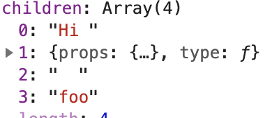
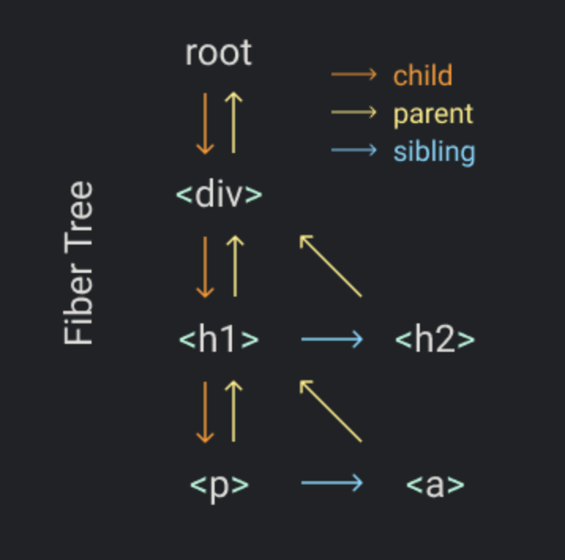

特别声明：该翻译仅供自己参考。如有兴趣请阅读原文。[原文地址](https://pomb.us/build-your-own-react/)

我们将依照React的架构，构造一个精简版的React，主要包括下面的内容：

1. createElement函数
2. render函数
3. Concurrent Mode（？并发模式）
4. Fibers
5. 渲染和提交（Render and Commit Phases）
6. Reconciliation（？对比）
7. 函数式组件
8. Hooks

<a name="H329q"></a>

## 首先，一些基础理论

让我们先来回顾一些基础理论。如果你对React，JSX，DOM很熟悉，你可以跳过这一小节。

```javascript
const element = <h1 title="foo">Hello</h1>
const container = document.getElementById("root")
ReactDOM.render(element, container)
```

一个三行代码的简单的React程序，第一行定义了一个React元素，第二行拿到了作为容器的Dom元素，第三行把React元素渲染到容器里，也就是渲染到真实Dom里。

接下来，让我们用纯JS代码替换掉所有React相关的代码。

上面第一行代码，使用了JSX。不是JS，需要替换掉。
JSX转换为JS通常是靠Babel这类工具，做的事也很简单，将JSX代码用createElement函数替换掉。
比如上面的代码替换完了就是

```javascript
React.createElement(
  "h1",
  {title:"foo"},
  "hello",
)
```

除了一些验证以外createElement从它的参数里创建出一个对象。所以我们可以暂时用返回的对象替换掉这个函数。

```javascript
const element = {
  type: "h1",
  props: {
    title: "foo",
    children: "Hello",
  },
}//这个就是由createElement创建的对象
const container = document.getElementById("root")
ReactDOM.render(element, container)
```

这就是createElement返回的对象，拥有type和props两个属性（我们暂时只关注这两个，其它属性后面再说）。

- type
  - string类型
  - 指代你创建真实DOM的tagName，也就是传递给document.createElement的值。
  - 也可能是一个function，后面再说。
- props
  - 是一个对象
  - 拥有jsx表达式中所有声明的属性
  - 额外的children属性,通常是一个数组

type是一个string类型，指代一个你想创建的真实Dom类型，也就是你创建HTML元素时，传递给document.createElement的tagName。但是type也可能时一个function，我们放到后面在说。
props则是一个对象，它拥有所以JSX中定义的属性，以及一个特殊的属性children。在上述列子中，children只是一个string，但通常情况下，它是一个代表着更多元素的array，这也是为什么elements是树形结构的。

剩下需要替换的是ReactDOM.render。这个函数是React渲染真实Dom的地方。让先暂时用浏览器原生API手动实现一下。

```javascript
const element = {
  type: "h1",
  props: {
    title: "foo",
    children: "Hello",
  },
}

const container = document.getElementById("root")

const node = document.createElement(element.type)
node["title"] = element.props.title

const text = document.createTextNode("")
text["nodeValue"] = element.props.children

node.appendChild(text)
container.appendChild(node)
```

首先我们根据type创建真实的DOM节点，上面的例子中就是H1。然后我们把所有属性添加上，例子中就只是title。
\~~*为了避免歧义，下面提到node就代表真实的Dom元素，而element代表React元素。*~~

接着，处理子元素，也就是children里的元素。例子中children就只是一个字符串，但通常children是一个包含多项子元素的数组。
babel在处理jsx的时候,文本节点和普通的html元素有些差异，文本节点直接是一个字符串，元素则是一个对象。如下图所示。

为了保持处理的一致性我们将文本节点也视为一个node节点，即TextNode。然后通过nodeValue设置文本。这样，就可以把文本节点看成

```javascript
{
	type : "TEXT_ELEMENT",
  props : {
  	nodeValue : "Hello"
  }
}
```

最后，我们只需要将textNode添加到h1，将h1添加到container容器里，然后就完了。现在我们拥有了一个和之前功能一样的App，而且没有使用React。

<a name="C8360"></a>

## Step1: createElement函数

```javascript
const element = (
  <div id="foo">
    <a>bar</a>
    <b />
  </div>
)
const container = document.getElementById("root")
ReactDOM.render(element, container)

```

我们从另一个简单的ReactApp开始。这次我们将用自己写的React替换掉React的代码。
从实现createElement开始，把JSX转换为JS，然后我们就能看到craeteElement内部到底发生了什么。

正如上面提到过的，createElement返回一个拥有type 和 props属性的对象。所以我们只需要写一个返回这个对象的函数即可。

```javascript
function createElement(type, props, ...children) {
  return {
    type,
    props: {
      ...props,
      children,
    },
  }
}
```

我们使用[*rest parameter syntax*](https://es6.ruanyifeng.com/?search=%E5%89%A9%E4%BD%99%E5%8F%82%E6%95%B0\&x=0\&y=0#docs/function#rest-%E5%8F%82%E6%95%B0)*，*来保证\_prop.children\_总是一个\_array。*
*
比如createElement('div'),createElement('div',null,a),createElement('div',null,a,b)。返回

```javascript
{
  type : "div",
  props : {
  	children : []
  }  
}//createElement('div')

{
  type : "div",
  props : {
  	children : [a]
  }  
}//createElement('div',null,a)

{
  type : "div",
  props : {
  	children : [a,b]
  }  
}//createElement('div',null,a,b)
```

当children中包含文本节点时，children中可能包含原始值string类型。我们需要对原始值进行单独处理，为文本节点创建一个单独的类型TEXT\_ELEMENT。

需要注意的时，React里并不会这样做。我们这样做是为了使代码更简单。

```javascript
function createElement(type, props, ...children) {
  return {
    type,
    props: {
      ...props,
      children: children.map(child =>
        typeof child === "object" ? child : createTextElement(child)
      )
    }
  };
}

function createTextElement(text) {
  return {
    type: "TEXT_ELEMENT",
    props: {
      nodeValue: text,
      children: []
    }
  };
}
```

现在有了我们自己的createElement函数，可以把React.createElement替换掉了，首先得取一个名字，Didact。

```javascript
function createElement(type, props, ...children) {
  return {
    type,
    props: {
      ...props,
      children: children.map(child =>
        typeof child === "object" ? child : createTextElement(child)
      )
    }
  };
}

function createTextElement(text) {
  return {
    type: "TEXT_ELEMENT",
    props: {
      nodeValue: text,
      children: []
    }
  };
}

const Didact = {
  createElement,
}

const element = Didact.createElement(
  "div",
  { id: "foo" },
  Didact.createElement("a", null, "bar"),
  Didact.createElement("b")
)
const container = document.getElementById("root")
ReactDOM.render(element, container)
```

上面的代码看起来仍然没有JSX直观，我们仍想使用JSX。可不可以让Babel直接翻译成我们自己写的createElement函数，而不是React的呢？答案是可以的。

```javascript
/** @jsx Didact.createElement */
const element = (
  <div id="foo">
    <a>bar</a>
    <b />
  </div>
)
```

我们可以使用@jsx标记，这样babel遇到jsx语法就会调用我们的Didact.createElement。

<a name="Yd93M"></a>

## Step2: render函数

现在来实现ReactDOM.render函数。让我们暂时只关心增加dom元素，稍后再处理更新和删除。

```javascript
function createElement(type, props, ...children) {
  return {
    type,
    props: {
      ...props,
      children: children.map(child =>
        typeof child === "object"
          ? child
          : createTextElement(child)
      ),
    },
  }
}

function createTextElement(text) {
  return {
    type: "TEXT_ELEMENT",
    props: {
      nodeValue: text,
      children: [],
    },
  }
}

function render(element, container) {
	const dom = element.type == "TEXT_ELEMENT"
  			?document.createTextNode("")
        :document.createElement(element.type);
  const isProperty = key=>key!=="children";
  Object.keys(element.props)
  	.filter(isProperty)
  	.forEach(name=>{
  		dom[name] = element.props[name];
  	});
  
  element.props.children.forEach(child=>render(child,dom));

  container.appendChild(dom)
}

const Didact = {
  createElement,
  render,
}

/** @jsx Didact.createElement */
const element = (
  <div id="foo">
    <a>bar</a>
    <b />
  </div>
)
const container = document.getElementById("root")
Didact.render(element, container)
```

render函数接收两个参数，element是JSX翻译过后产生的对象树，container是dom元素需要挂载的节点或者说容器。
render函数做的事如下：
1.render函数首先根据element的type值创建出对应的DOM元素。
2.然后设置props里除了children外的所有属性到DOM元素上。
3.遍历children元素，依次调用render函数，并把当前元素的DOM作为container传递进去。
4.添加DOM元素到container。

现在我们有了一个能把JSX渲染为DOM的库了。[代码地址](https://github.com/CodeByZack/build-your-react-code/tree/step1/2)

<a name="6lNgb"></a>

## Step3: Concurrent Mode（并发模式）

在开始下一步之前，还需要处理一个问题。如果元素嵌套（元素树）很深，我们的代码开始渲染过后，就不会停下来，直到渲染完毕才会去做其他事。这样就可能导致阻赛主线程过久，进而导致浏览器无法响应用户的操作、流畅的绘制动画。所以需要重构一下代码。

我们将把渲染工作分成许多更小的单元，每当完成一个单元的渲染，让浏览器能打断渲染去处理一些其它必要的事，然后再继续渲染。

```javascript
let nextUnitOfWork = null

function workLoop(deadline) {
  let shouldYield = false
  while (nextUnitOfWork && !shouldYield) {
    nextUnitOfWork = performUnitOfWork(
      nextUnitOfWork
    )
    shouldYield = deadline.timeRemaining() < 1
  }
  requestIdleCallback(workLoop)
}

requestIdleCallback(workLoop)

function performUnitOfWork(nextUnitOfWork) {
  // TODO
}
```

我们使用requestIdleCallback来制造循环，你可以把requestIdleCallback当成setTimeout，但是需要注意，不是我们决定什么时候去执行回调函数，而是浏览器空闲（IDLE）的时候会去主动调用。
React不使用[requestIdleCallback ](https://github.com/facebook/react/issues/11171#issuecomment-417349573)，现在使用[scheduler package](https://github.com/facebook/react/tree/master/packages/scheduler)。但是在理论上，对于我们现在的情况下，他们都是一样的。
requestIdleCallback有一个deadline参数，它代表距离下一次浏览器获得控制权的时间。

为了让循环能跑起来，我们需要手动设置第一个单元的渲染工作。然后实现一个performUnitOfWork函数，该函数不仅执行渲染而且返回下一个单元的渲染工作。

<a name="fmURR"></a>

## Step4: Fibers

为了组织我们的单元/渲染工作，我们需要一个数据结构：fiber tree。
我们会给每一个元素设置一个fiber，每一个fiber将代表一个单元的渲染工作。
看一个例子：
假如我们渲染一个元素树结构如下：

```javascript
Didact.render(
  <div>
    <h1>
      <p />
      <a />
    </h1>
    <h2 />
  </div>,
  container
)
```



在render函数里，我们会创建root fiber，并把它设置为nextUnitOfWork。剩下的工作将由performUnitOfWork来实现，我们将要做三件事：

1. 添加element到dom。
2. 为element的子元素创建fibers。
3. 确定下一个unit of work。

注：这里遍历树，采用的是[先序遍历](https://baike.baidu.com/item/%E5%89%8D%E5%BA%8F%E9%81%8D%E5%8E%86/757319?fr=aladdin)。

每个fiber都存有对first child，next sibling， parent的链接。

当我们完成一个fiber，它的child的fiber会成为下一个nextUnitOfWork。
在我们例子中，当我们完成div的fiber，下一个渲染的就是h1。

如果fiber没有child，我们会使用sibling（兄弟元素）作为下一个nextUnitOfWork。
比如，上述p元素没有child，则下一个fiber就是a元素。

如果fiber没有child和sibling，我们将把“uncle”：the sibling of the parent 作为下一个fiber，像上述例子中的a 和 h2。如果parent也没有sibling，我们继续往上查找parent's，直到我们找到一个带有sibling的或者直到我们达到root节点。如果我们达到了root节点，也就意味着我们完成了所有渲染工作。

代码实现如下：
首先，把render函数原有内容提取成createDom成为一个单独的函数。

```javascript
function createDom(fiber) {
  const dom =
    fiber.type == "TEXT_ELEMENT"
      ? document.createTextNode("")
      : document.createElement(fiber.type)

  const isProperty = key => key !== "children"
  Object.keys(fiber.props)
    .filter(isProperty)
    .forEach(name => {
      dom[name] = fiber.props[name]
    })

  return dom
}

function render(element, container) {
  // TODO set next unit of work
}
```

在render函数,设置第一个nextUnitWork，也就是root fiber。

```javascript
let nextUnitWork = null;

function render(element,container){
	nextUnitWork = {
  	dom: container,
    props: {
    	children : [element]
    }
  }
}
```

然后实现performUnitOfWork。再确认一次，这个函数做了以下三件事

1. 添加element到dom。
2. 为element的子元素创建fibers。
3. 确定下一个unit of work。

```javascript
function performUnitOfWork(fiber) {
  //创建dom，并储存在fiber.dom上
  if(!fiber.dom){
		fiber.dom = createDom(fiber);
	}
  //添加dom到父元素
  if(fiber.parent){
  	fiber.parent.dom.appendChild(fiber.dom);
  }
  
  //生成子元素的fiber并关联
  const elements = fiber.props.children;
  let index = 0;
  let prevSibling = null;
  while(index<elements.length){
  	const element = elements[index];
    const newFiber = {
    	type : element.type,
      props : element.props,
      parent : fiber,
      dom : null
    };
    if(index === 0){
    	fiber.child = newFiber;
    }else{
    	prevSibling.sibling = newFiber
    }
    prevSibling = newFiber;
    index++;
  }
  
  //返回fiber的child
  if(fiber.child){
  	return fiber.child
  }
  //返回sibling或者上一级的sibling
  let nextFiber = fiber;
  while(nextFiber){
  	if(nextFiber.sibling){
    	return nextFiber.sibling;
    }
    nextFiber = nextFiber.parent
  }
}
```

Step1-4[代码地址](https://github.com/CodeByZack/build-your-react-code/tree/step1-4)

<a name="YfAcr"></a>

## Step5: 渲染和提交阶段

现在我们有另一个问题了。我们处理fiber的时候，把生成的node实际添加到了dom里。而且，请记住，在我们渲染完整个dom树之前，浏览器可以随时打断我们的工作，那就意味着，用户可能看到一个不完整的UI，我们需要避免这个问题。

因此，我们需要先删除更改DOM的部分。然后用一个新变量wipRoot来保存对fiber tree的追踪。
然后，当我们完成所有fiber的dom节点创造过后，我们再统一提交到真正的dom上。我们在commitRoot里做这件事，遍历fiber树，把节点提交到真实dom上。

```javascript
//这段代码需要删除
 if(fiber.parent){
  fiber.parent.dom.appendChild(fiber.dom);
 }

//新变量
let wibRoot = null;

//render函数
function render(element, container) {
  wipRoot = {
    dom: container,
    props: {
      children: [element]
    }
  };
  nextUnitOfWork = wipRoot;
}


function commitRoot(){
  commitWork(wipRoot.child);
  wipRoot=null;
}

function commitWork(fiber){
  if(!fiber)return;
  const domParent = fiber.parent.dom;
  domParent.appendChild(fiber.dom);
  commitWork(fiber.child);
  commitWork(fiber.sibling);
}

function workLoop(deadLine) {
  let shouldYield = false;
  while (nextUnitOfWork && !shouldYield) {
    nextUnitOfWork = performUnitOfWork(nextUnitOfWork);
    shouldYield = deadLine.timeRemaining() < 1;
  }

  if (!nextUnitOfWork && wipRoot) {
    commitRoot()
  }
  
  if (nextUnitOfWork) {
    requestIdleCallback(workLoop);
  }
}
```

<a name="qPrre"></a>

## Step6:Reconciliation

目前为止，我们只是往DOM里添加，还没有处理更新和删除，接下来我们就处理这个。我们需要把render函数收到的elemets与已有的fiber tree进行比对。所以我们需要一个变量来保存上一次提交到DOM树的fiber tree，currentRoot。我们还需要在每个fiber上增加一个alternate属性，值为上一次提交阶段的老fiber。

```javascript
let currentRoot = null;

function commitRoot(){
	commitWork(wipRoot.child);
  currentRoot = wipRoot;
  wipRoot = null;
}

function render(element,container){
	wipRoot = {
  	dom: container,
    props: {
    	children:[element],
    },
    alternate: currentRoot,
  }
  nextUnitOfWork = wipRoot;
}


```

我们先来把创建new fiber的代码提取出来，单独成为一个函数reconcileChildren。~~我们在这个函数里协调旧的fibers 和 新的 elements。~~Here we will reconcile the old fibers with the new elements.

```javascript
function performUnitOfWork(fiber) {
  if (!fiber.dom) {
    fiber.dom = createDom(fiber)
  }
  const elements = fiber.props.children
  reconcileChildren(fiber, elements)
  if (fiber.child) {
    return fiber.child
  }
  let nextFiber = fiber
  while (nextFiber) {
    if (nextFiber.sibling) {
      return nextFiber.sibling
    }
    nextFiber = nextFiber.parent
  }
}

function reconcileChildren(wipFiber, elements) {
  let index = 0
  let prevSibling = null

  while (index < elements.length) {
    const element = elements[index]

    const newFiber = {
      type: element.type,
      props: element.props,
      parent: wipFiber,
      dom: null,
    }

    if (index === 0) {
      wipFiber.child = newFiber
    } else {
      prevSibling.sibling = newFiber
    }

    prevSibling = newFiber
    index++
  }
}
```

我们在reconcileChildren函数里，遍历元素时，同时遍历old fiber。除开遍历和取值的模版代码，我们需要关心的是old fiber 和 当前的element。对比出它们两个之间的差异。

```javascript
function reconcileChildren(wipFiber, elements) {
  let index = 0;
  let oldFiber = wipFiber.alternate && wipFiber.alternate.child;
  let prevSibling = null

  while (index < elements.length || oldFiber!= null) {
    const element = elements[index]
		let newFiber = null;
    //todo compare oldFiber to element
		if(oldFiber){
    	oldFiber = oldFiber.sibling;
    }
    if (index === 0) {
      wipFiber.child = newFiber
    } else {
      prevSibling.sibling = newFiber
    }

    prevSibling = newFiber
    index++
  }
}
```

我们使用type来进行比对。

1. old fiber 和 element 的 type值一样，我们继续使用原有DOM，只对它进行props的更新。
2. old fiber 和 element 的 type值不一样，且element存在，old fiber不存在，我们将创建一个新的DOM。
3. old fiber 和 element 的 type值不一样，且element不存在，old fiber存在，我们将删除旧的DOM。

React使用keys来进行更好的比对。例如它能检测到列表中元素顺序的变动。（不理解）

```javascript
function reconcileChildren(wipFiber, elements) {
  let index = 0;
  let oldFiber = wipFiber.alternate && wipFiber.alternate.child;
  let prevSibling = null

  while (index < elements.length || oldFiber!= null) {
    const element = elements[index]
		let newFiber = null;
    const sameType =
      oldFiber &&
      element &&
      element.type == oldFiber.type
    if (sameType) {
      // TODO update the node
    }
    if (element && !sameType) {
      // TODO add this node
    }
    if (oldFiber && !sameType) {
      // TODO delete the oldFiber's node
    }
		if(oldFiber){
    	oldFiber = oldFiber.sibling;
    }
    if (index === 0) {
      wipFiber.child = newFiber
    } else {
      prevSibling.sibling = newFiber
    }

    prevSibling = newFiber
    index++
  }
}
```

当old fiber type和 element type一样。我们创建一个new fiber，但是dom元素沿用old fiber的，props则更新为element的。与此同时，我们需要添加一个effectTag，我们会在提交阶段用到这个。

```javascript
if (sameType) {
    newFiber = {
      type: oldFiber.type,
      props: element.props,
      dom: oldFiber.dom,
      parent: wipFiber,
      alternate: oldFiber,
      effectTag: "UPDATE",
    }
  }
```

对于第二种情况，我们需要新创建DOM，并打上一个PLACEMENT effectTag。

```javascript
if (element && !sameType) {
    newFiber = {
      type: element.type,
      props: element.props,
      dom: null,
      parent: wipFiber,
      alternate: null,
      effectTag: "PLACEMENT",
    }
  }
```

对于第三种情况，我们需要删除DOM。但是并不存在一个新的fiber，所以我们需要在老的fiber上打上标记。
然后还有一个问题是，我们提交阶段使用的是wipRoot，但是该变量上并不存在old fibers。所以我们需要一个额外的数组来保存我们需要删除的old fibers。最后在提交阶段使用这个数组去做删除工作。

```javascript
let deletions = null;

function render(){
	...
  deletions = [];
  ...
}

function commitRoot(){
	deletions.forEach(commitWork);
  ...
}


if (oldFiber && !sameType) {
  oldFiber.effectTag = "DELETION"
  deletions.push(oldFiber)
}
```

接下来，我们来更改commitWork，使之能处理effectTags。
如果fiber有一个PLACEMENT effectTag，我们添加一个新dom。

```javascript
function commitWork(fiber) {
  if (!fiber) {
    return
  }
  const domParent = fiber.parent.dom
  if (
    fiber.effectTag === "PLACEMENT" &&
    fiber.dom != null
  ) {
    domParent.appendChild(fiber.dom)
  }
  commitWork(fiber.child)
  commitWork(fiber.sibling)
}
```

如果fiber有一个DELETION effectTag，我们执行删除操作。

```javascript
function commitWork(fiber) {
  if (!fiber) {
    return
  }
  const domParent = fiber.parent.dom
  if (
    fiber.effectTag === "PLACEMENT" &&
    fiber.dom != null
  ) {
    domParent.appendChild(fiber.dom)
  }else if(fiber.effectTag === "PLACEMENT"){
		domParent.removeChild(fiber.dom)
	}
  commitWork(fiber.child)
  commitWork(fiber.sibling)
}
```

最后，如果是UPDATE effectTag，我们需要用新的props更新存在的DOM节点。我们将在updateDom里做属性更新。

```javascript
function commitWork(fiber) {
  if (!fiber) {
    return
  }
  const domParent = fiber.parent.dom
  if (
    fiber.effectTag === "PLACEMENT" &&
    fiber.dom != null
  ) {
    domParent.appendChild(fiber.dom)
  } else if (
    fiber.effectTag === "UPDATE" &&
    fiber.dom != null
  ) {
    updateDom(
      fiber.dom,
      fiber.alternate.props,
      fiber.props
    )
  }else if(fiber.effectTag === "PLACEMENT"){
		domParent.removeChild(fiber.dom)
	}
  commitWork(fiber.child)
  commitWork(fiber.sibling)
}

function updateDom(){
	// TODO
}
```

我们比对新老props，移除已经不存在的props，添加新的prop，更新都有的prop。

还需要处理一类特殊的属性，事件监听器listener，所以如果prop name 以 on 开头，我们会特殊处理。

```javascript
const isEvent = key => key.startsWith("on")
const isProperty = key =>
  key !== "children" && !isEvent(key)
const isNew = (prev, next) => key =>
  prev[key] !== next[key]
const isGone = (prev, next) => key => !(key in next)
function updateDom(dom, prevProps, nextProps) {
  //Remove old or changed event listeners
  Object.keys(prevProps)
    .filter(isEvent)
    .filter(
      key =>
        !(key in nextProps) ||
        isNew(prevProps, nextProps)(key)
    )
    .forEach(name => {
      const eventType = name
        .toLowerCase()
        .substring(2)
      dom.removeEventListener(
        eventType,
        prevProps[name]
      )
    })
  // Remove old properties
  Object.keys(prevProps)
    .filter(isProperty)
    .filter(isGone(prevProps, nextProps))
    .forEach(name => {
      dom[name] = ""
    })
  // Set new or changed properties
  Object.keys(nextProps)
    .filter(isProperty)
    .filter(isNew(prevProps, nextProps))
    .forEach(name => {
      dom[name] = nextProps[name]
    })
  // Add event listeners
  Object.keys(nextProps)
    .filter(isEvent)
    .filter(isNew(prevProps, nextProps))
    .forEach(name => {
      const eventType = name
        .toLowerCase()
        .substring(2)
      dom.addEventListener(
        eventType,
        nextProps[name]
      )
    })
}
```

STEP1-6[代码地址](https://github.com/CodeByZack/build-your-react-code/tree/step1-6)

<a name="step-vii-function-components"></a>

###

<a name="ED7tY"></a>

## Step7:函数组件

我们接下来要实现函数组件，首先我们更改demo为简单的函数组件。

```javascript
function App(props) {
  return <h1>Hi {props.name}</h1>
}
const element = <App name="foo" />
const container = document.getElementById("root")
Didact.render(element, container)
```

如果把JSX写成JS是这样的

```javascript
function App(props) {
  return Didact.createElement(
    "h1",
    null,
    "Hi ",
    props.name
  )
}
//注意这个APP，不是一个tag了，是一个函数了
const element = Didact.createElement(App, {
  name: "foo",
})
```

函数组件在两个方面有不同：

- 函数组件的fiber没有dom节点
- 函数组件的children来自运行后的返回值，而不是直接从props里取

我们需要修改performUnitOfWork，在函数内判断当前fiber的type是不是function，来走不同的 update function。
在updateHostComponent我们保持和之前一致。
在updateFunctionComponent我们运行函数并得到children元素。

```javascript
function performUnitOfWork(fiber){
	...
  const isFunctionComponent =
    fiber.type instanceof Function
  if (isFunctionComponent) {
    updateFunctionComponent(fiber)
  } else {
    updateHostComponent(fiber)
  }
	...
}  

function updateFunctionComponent(fiber) {
  // TODO
}

function updateHostComponent(fiber) {
  if (!fiber.dom) {
    fiber.dom = createDom(fiber)
  }
  reconcileChildren(fiber, fiber.props.children)
}
```

在我们的列子中，fiber.type 是App函数，当我们执行App函数，它返回H1元素。当函数执行完毕，拿到children我们就可以按之前的流程继续执行下去了。

然后我们需要更改一下commitwork函数，因为现在有没有DOM节点的fiber存在。需要做两件事如下：
1.我们需要向上查找父级元素，直到找到一个拥有DOM节点的fiber。
2.当我们删除元素的时候，也需要向下查找到一个带有DOM节点的子元素进行删除。

```javascript
function commitWork(fiber){
  ...
  let domParentFiber = fiber.parent
  while (!domParentFiber.dom) {
    domParentFiber = domParentFiber.parent
  }
  const domParent = domParentFiber.dom
  ...
  if (
    fiber.effectTag === "PLACEMENT" &&
    fiber.dom != null
  ) {
    domParent.appendChild(fiber.dom)
  }
  ...
  else if (fiber.effectTag === "DELETION") {
    commitDeletion(fiber, domParent)
  }
  ...
}
  
 function commitDeletion(fiber, domParent) {
  if (fiber.dom) {
    domParent.removeChild(fiber.dom)
  } else {
    commitDeletion(fiber.child, domParent)
  }
}
```

STEP1-7[代码地址](https://github.com/CodeByZack/build-your-react-code/tree/step1-7)

<a name="0pQr7"></a>

## Step8:hooks

最后，让我们实现一下state。

先改造一下demo，经典的counter。

```javascript
const Didact = {
  createElement,
  render,
  useState,
}

function useState(){
	// TODO
}

function Counter() {
  const [state, setState] = Didact.useState(1)
  return (
    <h1 onClick={() => setState(c => c + 1)}>
      Count: {state}
    </h1>
  )
}
const element = <Counter />;
```

我们是在updateFunctionComponent里执行Counter函数的，现在我们还需要在这调用useState。

我们需要一些额外的全局的变量，wipFIber，hookIndex，以便在useState里使用。我们首先设置wipFiber为当前处理的fiber。然后我们需要在fiber添加一个hooks数组，储存在同一个组件中多次调用useState产生的hook。hookIndex按调用顺序一一对应上useState。

```javascript
let wipFiber = null;
let hookIndex = null;

function updateFunctionComponent(fiber){
	wipFiber = fiber;
  //每执行一个函数组件前，就重置index，保证顺序对应。
  hookIndex = 0;
  wipFiber.hooks = [];
  const children = [fiber.type(fiber.props)];
  reconcileChildren(fiber, children)
}

function useState(initial){
	//TODO
}

```

当函数组件内调用useState时，我们在wipFiber的alternate的hooks用hookIndex检查是否含有一个老的hook存在。如果存在就赋值给新hook，不存在就使用初始值。然后把新hook添加到wibFiber的hooks数组里。最后把新hook的值返回出去。

```javascript
function useState(initial){
	const oldHook = wipFiber.alternate && wipFiber.alternate.hooks && wipFiber.alternate.hooks[hookIndex];
  const hook = {
  	state : oldHook ? oldHook.state : initial;
  }
  wibFiber.hooks.push(hook);
  hookIndex++;
  return [hook.state];
}
```

useState还应该返回一个setState函数去更新state的值。这个setState接收的参数为暂时称之为action。我们需要把这个action放在hook里的quene存起来。然后模仿render函数，生成一个新的nextUnitOfWork，让数据能及时更新到页面上。

```javascript
function useState(initial){
	const oldHook = wipFiber.alternate && wipFiber.alternate.hooks && wipFiber.alternate.hooks[hookIndex];
  const hook = {
  	state : oldHook ? oldHook.state : initial;
  	queue: []
  }
  wibFiber.hooks.push(hook);
  hookIndex++;
  const setState = (action)=>{
  	hook.queue.push(action);
    wipRoot = {
    	dom: currentRoot.dom,
      props: currentRoot.props,
      alternate: currentRoot,
    }
    nextUnitOfWork = wipRoot;
    deletions = [];
  }
  
  return [hook.state,setState];
}
```

但是我们现在还没有执行action（作者默认action为函数）。
我们在下一次更新组件的时候执行它，我们从老hook中的queue中取出所有actions。然后依次执行，赋值给当前hook的state。这样返回出去的就是最新的state了。

STEP1-8[代码地址](https://github.com/CodeByZack/build-your-react-code/tree/step1-8)
