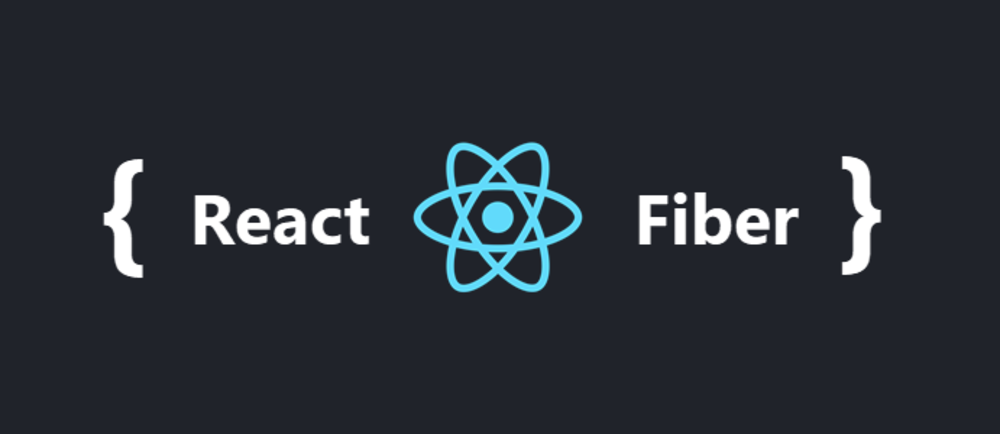
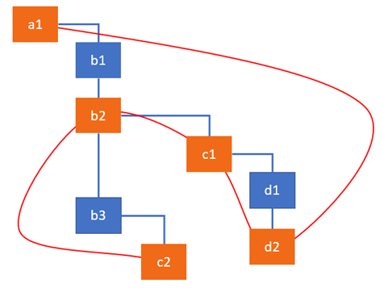

翻译仅供自己参考，请阅读原文
原文链接：<https://indepth.dev/inside-fiber-in-depth-overview-of-the-new-reconciliation-algorithm-in-react/>


**
**这篇文章详细的介绍了React中的新架构Fiber，和新recognition算法中的两个主要阶段。还会详细的了解到React是如何更新state和props，以及处理children的。**

React是一个用于构建用户界面的JavaScript库。React的[核心机制](https://indepth.dev/what-every-front-end-developer-should-know-about-change-detection-in-angular-and-react/)是检测组件和项目中的状态更改并将更改同步更新到屏幕上。
React中这一部分流程称之为**reconciliation。**当调用setState方法，React就开始检测state或者props是否有更改，然后重新渲染这个组件到UI上。

React的[文档](https://reactjs.org/docs/reconciliation.html)对该机制进行了一个高级的概述：React元素的角色，生命周期方法，render方法，以及运用到组件子元素上的diff算法。
通常，从React的render方法返回的不可变的React元素树被称为“虚拟DOM”。这个术语是为了在早些时候向人们解释React，但是它也十分容易引起误解，所以React文档里不再使用“虚拟DOM”这个词。在这篇文章里，我会坚持称其为React elements tree 元素树。

除了明显的React elements tree元素树，在React内部，始终具有一个用于保持状态的内部实例树（组件实例，dom节点等）。从版本16开始，React推出了一个新的内部实例树和管理它的算法Fiber。要了解更多Fiber架构带来的优势，可以看看[The how and why on React’s usage of linked list in Fiber](https://indepth.dev/the-how-and-why-on-reacts-usage-of-linked-list-in-fiber-to-walk-the-components-tree/)。

这是该系列的第一篇文章，旨在帮助你理解React的内部体系结构。在该篇文章中，我给你提供了一个与算法有关的重要概念和数据结构的深入概述。一旦我们了解了足够的背景知识，我们将继续探索用于遍和历处理Firber tree的主要算法和函数。
本系列的下一篇文章将演示React如何使用该算法执行初始渲染和处理state和props带来的更新。然后我们会讨论继续讨论scheduler，子元素的reconciliation过程，以及构建effects list的机制。

我将为你提供一些非常高级的知识？我鼓励您阅读它以了解Concurrent React内部原理背后的魔术。或者如果您打算开始为React做出贡献，那么这一系列文章也将为您提供很好的指导。我是[a strong believer in reverse-engineering](https://indepth.dev/level-up-your-reverse-engineering-skills/)，因此会有很多指向最新版本16.6.0的资源的链接。

要想理解内部原理是要花费大量时间和精力的，如果阅读过程中有什么不理解的地方，不必过于焦虑。只要明白在这上面花费的时间都是值得的。不过请注意，您无需了解本文的任何内容即可使用React。本文主要是关于React的内部工作原理的。

<a name="setting-the-background"></a>

## Setting the background

在本系列的文章中，我都将使用下面这个简单DEMO，Counter，点击一次就+1。


[在线demo](https://stackblitz.com/edit/react-t4rdmh)，代码如下：

```javascript
class ClickCounter extends React.Component {
    constructor(props) {
        super(props);
        this.state = {count: 0};
        this.handleClick = this.handleClick.bind(this);
    }

    handleClick() {
        this.setState((state) => {
            return {count: state.count + 1};
        });
    }


    render() {
        return [
            <button key="1" onClick={this.handleClick}>Update counter</button>,
            <span key="2">{this.state.count}</span>
        ]
    }
}
```

在 **reconciliation **期间，React会进行一系列的操作。比如，以下是我们的例子在React进行初始渲染和后续更新中执行的（原文为 high-level operations）操作：

- 更新ClickCounter的state中的count属性
- 找到并对比ClickCounter的子元素以及它们的props
- 更新span元素的props属性

在**reconciliation**期间，还有其它操作，比如调用生命周期函数，或者更新refs。**所有这些操作在Fiber体系结构中统称为“work”**。“work”的类型通常取决于React元素的类型。

比如，class组件，React需要创建类的实例，但是在函数组件中并不需要。React中拥有许多种类的元素，class组件/functional 组件/host组件（dom节点）/portals 等，React元素的类型由函数[createElement](https://github.com/facebook/react/blob/b87aabdfe1b7461e7331abb3601d9e6bb27544bc/packages/react/src/ReactElement.js#L171)的第一个参数所定义。这个函数通常用于render方法中创建元素。

在开始探索Fiber算法以及那些内部操作过程前，让我们先熟悉下React内部使用的数据结构。

<a name="from-react-elements-to-fiber-nodes"></a>

## From React Elements to Fiber nodes

React组件都会有一个代表UI的对象，我们通常叫做view或者template。这个对象通常是由组件的render方法返回的，函数组件就是函数的返回值。（其实就是JSX）。

针对我们示例中的Counter组件，template则是下面这样：

```javascript
<button key="1" onClick={this.onClick}>Update counter</button>
<span key="2">{this.state.count}</span>
```

<a name="react-elements"></a>

### React Elements

template会经过JSX编译器的处理，然后返回React elements。React elements是组件render的方法真正返回的东西，而不是HTML。如果我们不使用JSX，示例中的render函数看起来会像这样：

```javascript
class ClickCounter {
    ...
    render() {
        return [
            React.createElement(
                'button',
                {
                    key: '1',
                    onClick: this.onClick
                },
                'Update counter'
            ),
            React.createElement(
                'span',
                {
                    key: '2'
                },
                this.state.count
            )
        ]
    }
}
```

React.createElement函数会创建如下的数据结构：

```javascript
[
    {
        $$typeof: Symbol(react.element),
        type: 'button',
        key: "1",
        props: {
            children: 'Update counter',
            onClick: () => { ... }
        }
    },
    {
        $$typeof: Symbol(react.element),
        type: 'span',
        key: "2",
        props: {
            children: 0
        }
    }
]
```

您可以看到React将`[$$typeof](https://overreacted.io/why-do-react-elements-have-typeof-property/)`属性添加到这些对象中，以唯一地将它们标识为React元素。然后其它属性`type`，`key`，和`props`用于描述这个元素。他们的值都取自你传递给`React.createElement`的参数。

需要注意下，props中是如何表示文本内容，和click handler的。React元素上还有其他属性（例如ref属性）这些属性不在本文讨论范围之内。

代表ClickCounter的React元素没有任何key或props：

```javascript
{
    $$typeof: Symbol(react.element),
    key: null,
    props: {},
    ref: null,
    type: ClickCounter
}
```

<a name="fiber-nodes"></a>

### Fiber nodes

在 **reconciliation **期间，React元素的 `render` 函数返回的数据都会被更新到 Fiber tree 里。每个 React 元素都对应一个 Fiber 节点。和 React 元素不一样，Fiber不一定每次渲染时都会重建。Fiber tree 是可变的数据结构，保存了组件的 state 和 DOM 。

上文说过，根据 React 元素的 type 不同，需要进行不同的操作。

在我们上面的例子中，对于 `ClickCounter` 这个类组件，需要调用各种生命周期方法，和 render 方法，然而对于 `span` 这种host组件（ DOM 节点），它只是需要 DOM 更新。因此，每个 React 元素都会转换为[相应类型](https://github.com/facebook/react/blob/769b1f270e1251d9dbdce0fcbd9e92e502d059b8/packages/shared/ReactWorkTags.js)的 Fiber节点，类型代表了这个元素需要进行哪些操作（work）。

**你可以认为 Fiber 是一个代表了有待做 work 的数据结构，或者换句话说，Fiber是一个工作单元（a unit of work）。此外 Fiber 体系结构还非常便于追踪，调度，暂停和中止 work。**

当 React 元素第一次转换为 Fiber 节点的时候，React 使用元素内部的数据通过[createFiberFromTypeAndProps](https://github.com/facebook/react/blob/769b1f270e1251d9dbdce0fcbd9e92e502d059b8/packages/react-reconciler/src/ReactFiber.js#L414)函数来创建 Fiber 。在后续更新中，React 重用了 Fiber 节点，并只更新那些需要更新的属性。

React 可能需要根据 key 属性，来操作节点的层级变化，或者 render 方法不再返回有效 element 的时候，将其删除。

> **在[ChildReconciler](https://github.com/facebook/react/blob/95a313ec0b957f71798a69d8e83408f40e76765b/packages/react-reconciler/src/ReactChildFiber.js#L239)函数中，你可以找到所有当前存在的Fiber所关联的操作类型列表以及函数实现。**

React 会为每个 React元素 创建一个 Fiber 节点，由于 React 元素本身就是一颗树形结构，所以我们也会有一颗 Fiber tree。我们的示例Demo中的 Fiber tree 看起来像下面这样：


从图中可以看出,所有的 Fiber 节点都由 child，sibling，return 属性连接起来。至于为什么要采用这种形式，你可以参考 [The how and why on React’s usage of linked list in Fiber](https://medium.com/dailyjs/the-how-and-why-on-reacts-usage-of-linked-list-in-fiber-67f1014d0eb7)。

<a name="current-and-work-in-progress-trees"></a>

### Current and work in progress trees

在第一次渲染结束后，React 内部会有一个 Fiber tree，代表了已经渲染到屏幕的上的UI状态。这个 Fiber tree 在代码里叫做 **current**。
当React处理更新的时候，还会生成一个叫做 `workInProgress` 的 Fiber tree，代表着即将要渲染到屏幕上的UI状态更新。

所有被执行的 work ，都是 `workInProgress` 上的 Fiber 节点的 work。当 React 遍历 current 树，每个已存在的 Fiber，都会创建一个替代的 Fiber ，用来组成  `workInProgress tree` 。新创建的 Fiber 同样使用 `render`** **方法返回的 React 元素来构建。
一旦更新相关的所有工作都完成了，React 就会有一个代表即将渲染到屏幕上的更新，新的 Fiber tree，叫做`workInProgress tree`。
一旦`workInProgress tree`** **渲染到了屏幕上，它就又变成了`current tree`** **。

React 的核心原则之一是一致性（consistency）。React 总是一次性渲染所有DOM更新，不会一部分一部分的渲染。`workInProgress tree` 像一份对用户不可见的“草稿”，所以React可以先完成所有必要的 work，然后再一次性提交更新结果到屏幕上。

每个 Fiber 节点，都有一个 **alternate **属性，指向另一个 tree 上与它对应的 Fiber。 `current tree`  上的 Fiber 指向 `workInProgress tree`  上对应的 Fiber ，反之亦然。

<a name="side-effects"></a>

### Side-effects

我们可以认为 React 组件 就是一个利用 state 和 props 计算UI状态的函数。其它的像改变DOM，调用生命周期方法之类的行为通通被考虑为 side-effect(副作用)，或者简单称为 effect(作用)。Effects 的相关内容在[文档](https://reactjs.org/docs/hooks-overview.html#%EF%B8%8F-effect-hook)里有提到 。

你可能在react 组件里 执行过数据获取，事件订阅，更改DOM等操作。我们称这些操作为“side effects”（或者简单称为“effects”）。因为这些操作可能影响其它组件，而且并不能在 rendering 期间完成。

事实上大多数state和props更新都会导致副作用。而且正因为执行副作用（applying effects）在React里也是一种work的类型，所以 Fiber 也是除开update外的一种便利的机制去追踪 effects 。每个Fiber都可能有与之关联的 effects ，它们被保存在`effectTag` 属性上。

简单来讲，Fiber 的 effects 定义了当元素实例更新完成后需要完成的其它 [work](https://github.com/facebook/react/blob/b87aabdfe1b7461e7331abb3601d9e6bb27544bc/packages/shared/ReactSideEffectTags.js)。
对于host components（DOM elements），就是新增，更新，删除等操作。
对于class components，可能需要更新 refs，调用 componentDidMount/Update 生命周期。
当然还有其它一些 effects 定义了其它 Fiber 类型对应的 work 。

<a name="effects-list"></a>

### Effects list

React的更新过程是非常快的，为了做到那种程度的快，React使用了一些有趣的技术手段。**其中一个就是对拥有 effects 的 Fiber 构建一个线性表来进行快速迭代**。因为迭代线性表肯定比迭代树结构快多了，另外确实也没必要迭代那些没有 side-effect 的 Fiber 节点。

线性表的目的就是标记那些拥有像更新 DOM 之类的 side effect 的 Fiber。这个线性表是 `finishedWork tree` 的一个子集，使用 `nextEffect` 来进行连接。不像之前的 `current` 和 `workInProgress` tree 使用 child 来连接。

[Dan Abramov](https://medium.com/u/a3a8af6addc1?source=post_page---------------------------) offered an analogy for an effects list. He likes to think of it as a Christmas tree, with “Christmas lights” binding all effectful nodes together. （大概意思 Dan Abramov 提供了一个类比，想象一颗圣诞树，然后上面发出的灯光连成了一条线，把所有的拥有effect的节点连接起来了。）

为了更加直观，可以看图中黄色标记的 Fiber 节点，那代表着仍有一些 work 需要处理。比如说，更新操作导致了`c2`被插入DOM，`d2`和`c1`改变了属性，然后`b2`需要调用生命周期函数。这些都会被线性表 也就是 effect list 连接起来，所以当 React 要开始执行 effect 的时候 ，就可以直接跳过没有 side effect 的节点了。



上图中 你可以看到 effects 是怎么连接起来的。当开始遍历节点时，React使用 firstEffect 指向线性表的头部。所以上面这副图可以简化成下面这样的线性表：


<a name="root-of-the-fiber-tree"></a>

### Root of the fiber tree

<a name="RYPAw"></a>

### &#xA;

每个React应用都至少有一个扮演Container的DOM节点。在我们的示例中，就是ID为container的div元素。

```javascript
const domContainer = document.querySelector('#container');
ReactDOM.render(React.createElement(ClickCounter), domContainer);
```

React为每个container创建了一个 [fiber root](https://github.com/facebook/react/blob/0dc0ddc1ef5f90fe48b58f1a1ba753757961fc74/packages/react-reconciler/src/ReactFiberRoot.js#L31) 的对象。你可以通过container元素的引用访问到这个fiber root：

```javascript
const fiberRoot = query('#container')._reactRootContainer._internalRoot
```

fiber root 对象中的 current 属性保存了对 fiber tree 的引用：

```javascript
const hostRootFiberNode = fiberRoot.current
```

fiber tree 最顶层是一个特殊的fiber类型 [HostRoot](https://github.com/facebook/react/blob/cbbc2b6c4d0d8519145560bd8183ecde55168b12/packages/shared/ReactWorkTags.js#L34)，代表着你顶层元素的父节点。`HostRoot`节点拥有一个`stateNode`属性指回`FiberRoot`：

```javascript
fiberRoot.current.stateNode === fiberRoot; // true
```

你可以从`HostRoot` （fiber tree/current tree 的顶层节点）开始探索每一个 Fiber 节点。或者你也可以直接从组件实例访问一个单独的Fiber节点。像这样：

```javascript
compInstance._reactInternalFiber
```

<a name="fiber-node-structure"></a>

### Fiber node structure

我们现在看看示例中ClickCounter组件的Fiber节点的结构：

```javascript
{
    stateNode: new ClickCounter,
    type: ClickCounter,
    alternate: null,
    key: null,
    updateQueue: null,
    memoizedState: {count: 0},
    pendingProps: {},
    memoizedProps: {},
    tag: 1,
    effectTag: 0,
    nextEffect: null
}
```

然后span的Fiber节点结构：

```javascript
{
    stateNode: new HTMLSpanElement,
    type: "span",
    alternate: null,
    key: "2",
    updateQueue: null,
    memoizedState: null,
    pendingProps: {children: 0},
    memoizedProps: {children: 0},
    tag: 5,
    effectTag: 0,
    nextEffect: null
}
```

Fiber 结构有大量的属性。之前已经提到过了`alternate`，`effectTag`，`nextEffect`的作用。接着看看其它属性。

<a name="statenode"></a>

### stateNode

保存class组件的实例，或者真实的DOM节点，或者 Fiber 对应的其它 React 元素类型。一般来说，我们可以认为这个属性保存了 Fiber 的本地状态。

<a name="type"></a>

### type

定义了 Fiber 相关的 class 或者函数。对于 class 组件，指向了构造函数，对于DOM 元素，它指明了HTML tag。我经常用这个属性来确定 Fiber 与那些元素相关。

<a name="tag"></a>

### tag

定义了 Fiber 的[类型](https://github.com/facebook/react/blob/769b1f270e1251d9dbdce0fcbd9e92e502d059b8/packages/shared/ReactWorkTags.js)。用于 reconciliation 算法中，检测需要进行那种类型的 work 。之前提到过，work 的类型是随着 React 元素类型变化的。
函数[createFiberFromTypeAndProps](https://github.com/facebook/react/blob/769b1f270e1251d9dbdce0fcbd9e92e502d059b8/packages/react-reconciler/src/ReactFiber.js#L414)把 React 元素对应到正确的 Fiber 节点类型。在我们的示例中，ClickCounter组件的tag值是1，代表这是一个`ClassComponent`，span 元素的 tag 值是5，代表这是一个`HostComponent`。

<a name="updatequeue"></a>

### updateQueue

一个队列，存放state更新，回调函数，和DOM更新操作。

<a name="VqXFK"></a>

### memoizedState

State of the fiber that was used to create the output. When processing updates it reflects the state that’s currently rendered on the screen.
（存放了state属性，当进行更新的时候，代表了之前一次的state。） <a name="memoizedprops"></a>

### memoizedProps

Props of the fiber that were used to create the output during the previous render.
（存放上次用来渲染的props属性） <a name="pendingprops"></a>

### pendingProps

Props that have been updated from new data in React elements and need to be applied to child components or DOM elements.
（当前用来更新组件的props属性） <a name="key"></a>

### key

元素的唯一标识符，帮助React识别同一级元素列表中，那些元素改变了，新增了，或者被移除了。它与React文档中的 [“lists and keys”](https://reactjs.org/docs/lists-and-keys.html#keys) 有关。

你可以在[这里](https://github.com/facebook/react/blob/6e4f7c788603dac7fccd227a4852c110b072fe16/packages/react-reconciler/src/ReactFiber.js#L78)看到 Fiber node 的完整结构。我在上面的解释中省略了大量属性。特别是，我跳过了`child`，`sibling` ，`return` ，这些构成了我[上篇文章](https://indepth.dev/the-how-and-why-on-reacts-usage-of-linked-list-in-fiber-to-walk-the-components-tree/)中的提到过的树形数据结构。其它一些诸如`expirationTime`，`childExpirationTime`** **和 `mode` 属性，则是和`Scheduler`相关的。

<a name="general-algorithm"></a>

## General algorithm

React内部运作主要分为两个阶段：**render **和 **commit**。

在`render`阶段，React 组件会应用通过`setState`或者 `React.render` 安排的更新，找出UI上需要更新的内容。如果是首次渲染，React 会为每个 render 函数返回的元素创建一个新的 Fiber。在后续更新中，现有的 React元素对应的 Fiber 会被重复利用和更新。

**render 阶段完成后， 会得到一颗带有 side-effects 的 Fiber node tree**。effects 描述了在`commit`阶段需要完成的work。在`commit`阶段，React遍历这颗带有 effects 的 Fiber tree，并把更改应用到实例上。然后再遍历 effects list，执行DOM更新，和其它更改。并使之对用户可见。

**需要明白，render阶段是可能会是异步执行的**。React 根据可用的时间，可能会处理一个或者多个 Fiber ，然后就会暂存当前已完成的work，让浏览器去处理某些事件，当有空余时间后，它又会从上次停下的地方继续处理。但有些时候，它可能放弃已经完成的 work，然后从头开始。

因为**render**阶段的工作不会导致任何用户可见的更改（如DOM更新），才使得暂停 work 的行为变得可以接受。

**作为对比，接下来的commit阶段，总是同步的**。这是因为这个阶段的工作始终会导致用户可见的更改（如DOM更新）。所以React要一次性完成这个阶段。

调用生命周期方法是 React 中的一种 work 类型。其中一些方法在**render**阶段调用，另一些在**commit**阶段调用。以下的方法在**render**阶段被调用：

- \[UNSAFE\_]componentWillMount (deprecated)
- \[UNSAFE\_]componentWillReceiveProps (deprecated)
- getDerivedStateFromProps
- shouldComponentUpdate
- \[UNSAFE\_]componentWillUpdate (deprecated)
- render

如你所看到的，从React 16.3开始，在**render**阶段执行的一些遗留的生命周期方法被标记为`UNSAFE`的。现在这些方法在文档被称为遗留的生命周期。它们将在未来的16.x版本中被弃用，而不带`UNSAFE`前缀的对应版本将在17.0中被删除。你可以从文档中了解[更多](https://reactjs.org/blog/2018/03/27/update-on-async-rendering.html)。

那么这么做的目的是什么？

我们刚才了解到，**render**阶段不会产生像DOM更新那样的 side-effect ，React可以异步的去处理组件更新(甚至可以在多个线程中处理)。然而，被`UNSAFE`标记的生命周期经常被误解和滥用。开发者倾向于在这些方法里执行带有 side-effects 的代码，但是这在新的异步渲染模式（Concurrent  Mode）中可能会出现问题。尽管只有不带 `UNSAFE` 前缀的方法会被移除，但在即将到来的 Concurrent Mode（你也可以选择不用异步渲染） 中，带有`UNSAFE` 的生命周期仍然可能会出现问题。

以下是会在`commit`阶段执行的生命周期：

- getSnapshotBeforeUpdate
- componentDidMount
- componentDidUpdate
- componentWillUnmount

因为这些方法在同步的commit阶段执行，所以他们可能包含side-effects或者操作dom。

好的，现在我们拥有了足够的背景知识来看看用于遍历树结构和执行 work 的通用算法。让我们继续。。。

<a name="CaD22"></a>

## Render phase

reconciliation 算法使用 [renderRoot](https://github.com/facebook/react/blob/95a313ec0b957f71798a69d8e83408f40e76765b/packages/react-reconciler/src/ReactFiberScheduler.js#L1132) 方法，从顶层的`HostRoot`开始遍历。然而，React会跳过已处理过的 Fiber，直到找到未完成 work 的 Fiber。举个例子，假如你在组件树深处某个组件内部调用了`setState` ，React会从树顶部开始遍历，但是迅速跳过父级组件，直到找到调用了`setState` 方法的组件。

<a name="PvWn0"></a>

### Main steps of the work loop

所有的 Fiber 节点都在一个work loop中执行。下面是这个loop同步部分的实现：

```javascript
function workLoop(isYieldy) {
  if (!isYieldy) {
    while (nextUnitOfWork !== null) {
      nextUnitOfWork = performUnitOfWork(nextUnitOfWork);
    }
  } else {...}
}
```

在上面的代码中，`nextUnitOfWork`持有一个 workInProgress tree 上 Fiber 节点的引用，且该节点有 work 需要做 。当 React 遍历 Fiber tree 时，它也使用这个变量来判断是否还有未完成的 work 。在当前 Fiber 完成后，该变量会指向 tree 上的另外一个 需要处理的 Fiber 节点 或者 null。当指向null时，意味着React退出当前的 work loop，然后准备进行下一个**commit** 阶段。

遍历 Fiber tree 和初始，完成 work 用到的四个主要方法：

- [performUnitOfWork](https://github.com/facebook/react/blob/95a313ec0b957f71798a69d8e83408f40e76765b/packages/react-reconciler/src/ReactFiberScheduler.js#L1056)
- [beginWork](https://github.com/facebook/react/blob/cbbc2b6c4d0d8519145560bd8183ecde55168b12/packages/react-reconciler/src/ReactFiberBeginWork.js#L1489)
- [completeUnitOfWork](https://github.com/facebook/react/blob/95a313ec0b957f71798a69d8e83408f40e76765b/packages/react-reconciler/src/ReactFiberScheduler.js#L879)
- [completeWork](https://github.com/facebook/react/blob/cbbc2b6c4d0d8519145560bd8183ecde55168b12/packages/react-reconciler/src/ReactFiberCompleteWork.js#L532)

为了演示如何使用它们，请看下面的动态演示。我在演示中使用了这些函数的简化实现。每个函数都接受一个 Fiber node 进行处理，随着 React 往树深处遍历，你可以看到当前激活的 Fiber 发生改变。你可以清楚的看到这个算法是怎么从一个分支到另一个分支的。它首先完成子节点的工作，然后再完成父元素的工作。


注意，直线垂直链接表示sibling节点，而弯曲的连接表示子节点。例如b1没有子节点，而b2有一个子节点c1。

这里是视频的[链接](https://vimeo.com/302222454)，你可以随时暂停来看看到底是怎么回事。从概念上讲，你可以认为“开始”就是进入一个组件，“完成”就是跳出一个组件。你也可以在这个[代码库](https://stackblitz.com/edit/js-ntqfil?file=index.js)体验一下。

我们先看看 performUnitOfWork 和 beginWork 这两个方法:

```javascript
function performUnitOfWork(workInProgress) {
    let next = beginWork(workInProgress);
    if (next === null) {
        next = completeUnitOfWork(workInProgress);
    }
    return next;
}

function beginWork(workInProgress) {
    console.log('work performed for ' + workInProgress.name);
    return workInProgress.child;
}
```

`performUnitOfWork` 从`workInProgress` 接收一个 Fiber，然后调用`beginWork`** **函数启动work。这个函数会执行当前 Fiber 所需要所有任务。出于演示的目的，示例中只是简单的打印出 Fiber 的名字，来表明 work 已完成。**函数`beginWork` 总是返回下一个要处理的子节点的指针或者null**。

如果存在下一个子节点，则会被赋值给 `workLoop`函数中的 `nextUnitOfWork` 变量。当没有子节点的时候，React则知道它达到了这个分支的底部，所以它可以完成当前这个节点。**一旦节点的work完成了，它将处理同级节点的work，并在此之后回溯到父节点**。这是在 `completeUnitOfWork` 函数中完成的：

```javascript
function completeUnitOfWork(workInProgress) {
    while (true) {
        let returnFiber = workInProgress.return;
        let siblingFiber = workInProgress.sibling;

        nextUnitOfWork = completeWork(workInProgress);

        if (siblingFiber !== null) {
            // If there is a sibling, return it
            // to perform work for this sibling
            return siblingFiber;
        } else if (returnFiber !== null) {
            // If there's no more work in this returnFiber,
            // continue the loop to complete the parent.
            workInProgress = returnFiber;
            continue;
        } else {
            // We've reached the root.
            return null;
        }
    }
}

function completeWork(workInProgress) {
    console.log('work completed for ' + workInProgress.name);
    return null;
}
```

你可以看到上面这个代码片段是一个大的while循环。当`workInProgress` 节点没有子节点的时候，React会进入该函数。当完成当前 Fiber 的 work，它会检查这里是否有sibling节点。如果有，React退出当前函数，返回这个sibling节点。它会被赋值给`nextUnitOfWork` ，然后 React 开始执行这个分支相关的工作。重要的是要了解，此时此刻，React只完成了先前的sibling节点的work，并没有完成父节点的work。**只有当以子节点开始的所有分支都完成了自己的工作，它才会完成父节点和回溯的工作**。

从实现中可以看到，`performUnitOfWork`和`completeUnitOfWork` 主要用于迭代目的。而`beginWork` 和`completeWork` 函数用于处理work的开始和完成。在该系列后续文章中，我们会了解，当进入`beginWork` 和`completeWork` ，`ClickCounter` 组件会发生些什么。

<a name="commit-phase"></a>

## Commit phase

这个阶段从函数 `completeRoot` 开始。This is where React updates the DOM and calls pre and post mutation lifecycle methods.（这就是React更新DOM并执行可以带有副作用生命周期方法的地方）

当 React 进入这个阶段，内部有两颗 Fiber 树 和 一个 effcts list 。第一颗Fiber树（ `current` ）代表着上次渲染到屏幕上的状态。另外一颗树是在render阶段新产生的一颗备用的树，在源码里叫做`finishedWork` 或者`workInProgress` ，代表即将要刷新到屏幕上的状态。This alternate tree is linked similarly to the current tree through the `child` and `sibling` pointers.(用于替换的树，拥有和current一样的结构，使用child，sibling属性链接)


另外，这还有一个effects列表，是`finishedWork`  树的子集，通过 `nextEffect` 属性连接起来的。记住，effects list 是在 **render **阶段生成的。**render **阶段的主要目的就是检测出哪些节点需要增加，删除，更新，哪些组件需要调用他们的生命周期函数。这就是 effect list 存在的意义。effect list 也是 commit 阶段需要遍历的节点集合。

出于调试的目的，current tree 可以通过 Fiber root 的current属性来访问。finishedWork tree 可以通过 current tree中的HostFiber node的alternate 属性访问。

commit 阶段执行的主要函数是[commitRoot](https://github.com/facebook/react/blob/95a313ec0b957f71798a69d8e83408f40e76765b/packages/react-reconciler/src/ReactFiberScheduler.js#L523)，简单来讲，它做了以下这些事：

- 在标记为`Snapshot` effect 的节点上，执行`getSnapshotBeforeUpdate `生命周期方法。
- 在标记为`Deletion` effect 的节点上，，调用`componentWillUnmount`生命周期方法。
- 执行所有DOM的插入，更新，删除。
- 把`finishedWork`** **设置为current。
- 在标记为`Placement` effect 的节点上，调用`componentDidMoun`生命周期方法。
- 在标记为`Update` effect 的节点上，调用`componentDidUpdate`生命周期方法。

在调用 pre-mutation 方法 `getSnapshotBeforeUpdate ` 后，React提交所有的effect。分为两步，第一步，执行所有的DOM新增，更新，删除和ref卸载，然后React把`finishedWork` 赋值给`FiberRoot` ，将`workInProgress` 标记为`current`** **。所以在`componentWillUnmount`中，current 指向之前渲染到屏幕上的Fiber tree。然而在第二步中执行的`componentDidMount**/**Update` 生命周期中，current 指向就已经是 `finishedWork`  了。在第二步中，React调用了所有剩下的生命周期函数和 ref 回调。这些方法作为单独的过程执行，这样整颗树中的所有放置、更新和删除都已被调用。

下面是上面描述的代码片段:

```javascript
function commitRoot(root, finishedWork) {
    commitBeforeMutationLifecycles()
    commitAllHostEffects();
    root.current = finishedWork;
    commitAllLifeCycles();
}<>
```

这些子函数中的每一个子函数都实现一个循环，循环遍历效果effect list。当它发现与函数的目的相关的effect时，它就会执行它。

<a name="pre-mutation-lifecycle-methods"></a>

### Pre-mutation lifecycle methods

Here is, for example, the code that iterates over an effects tree and checks if a node has the&#x20;
`Snapshot`** **effect:

例如，下面的代码是在检查节点中是否有 `Snapshot`** **effect:

```javascript
function commitBeforeMutationLifecycles() {
    while (nextEffect !== null) {
        const effectTag = nextEffect.effectTag;
        if (effectTag & Snapshot) {
            const current = nextEffect.alternate;
            commitBeforeMutationLifeCycles(current, nextEffect);
        }
        nextEffect = nextEffect.nextEffect;
    }
}<>
```

对于一个class 组件，这个effect意味着调用`getSnapshotBeforeUpdate`** **生命周期方法。

<a name="dom-updates"></a>

### DOM updates

[commitAllHostEffects](https://github.com/facebook/react/blob/95a313ec0b957f71798a69d8e83408f40e76765b/packages/react-reconciler/src/ReactFiberScheduler.js#L376)是React执行DOM更新的地方，该函数定义了节点需要执行的操作类型，然后执行它：

```javascript
function commitAllHostEffects() {
    switch (primaryEffectTag) {
        case Placement: {
            commitPlacement(nextEffect);
            ...
        }
        case PlacementAndUpdate: {
            commitPlacement(nextEffect);
            commitWork(current, nextEffect);
            ...
        }
        case Update: {
            commitWork(current, nextEffect);
            ...
        }
        case Deletion: {
            commitDeletion(nextEffect);
            ...
        }
    }
}<>
```

有趣的是，React在`commitDeletion` 内调用了`componentWillUnmount`** **。

<a name="post-mutation-lifecycle-methods"></a>

### Post-mutation lifecycle methods

commitAllLifecycles 里会调用所有剩下的生命周期方法，包括`componentDidUpdate/Mount`** **。

原文链接：[https://indepth.dev/inside-fiber-in-depth-overview-of-the-new-reconciliation-algorithm-in-react](https://indepth.dev/inside-fiber-in-depth-overview-of-the-new-reconciliation-algorithm-in-react/)。
原文系列下一篇文章的连接：[In-depth explanation of state and props update in React](https://indepth.dev/in-depth-explanation-of-state-and-props-update-in-react/)。
