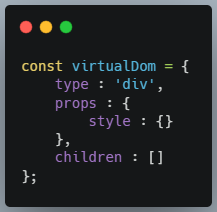
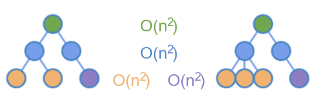
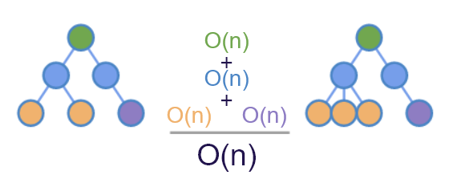

## 虚拟dom的由来

虚拟dom最开始是出现在react里的，因为当时facebook想把后端的模板迁移到js里，然后就有了jsx。但是在处理更新的时候需要手动去操作dom（把模板翻译成真实dom），传统 DOM API 细节又太多，操作复杂，所以就很容易出现 Bug，而且代码难以维护。
然后就有了react的核心思想，**始终整体“刷新”页面当发生前后状态变化时，React 会自动更新 UI**。让我们从复杂的 UI 操作中解放出来，使我们只需关于状态以及最终 UI 长什么样。**只需要关系我的状态（数据是什么），以及 UI 长什么样（布局），不再需要关系操作细节**。具体可以参考这篇文章[react是怎样练成的](https://segmentfault.com/a/1190000013365426#item-4)。

这种方法有两个问题
1.毫无疑问的很慢，一点更新就需要更新整个dom树。
2.还有一个问题就是这样无法包含节点的状态。比如它会失去当前聚焦的元素和光标，以及文本选择和页面滚动位置，这些都是页面的当前状态。

为了解决上面说的问题，facebook提出了对于没有改变的 DOM 节点，让它保持原样不动，仅仅创建并替换变更过的 DOM 节点。这种方式实现了 DOM 节点**复用**（Reuse）。
至此，只要能够**识别**出哪些节点改变了，那么就可以实现对 DOM 的更新。于是问题就转化为**如何比对两个 DOM 的差异**。也就是diff。

对了上面好像没提到虚拟dom，其实jsx在js里存在形态就是一个对象，这个对象一般就叫做虚拟dom了。

## 虚拟DOM 就是一个js对象

虚拟dom实际上就是一个js对象，没有什么神奇，大概就长下面这样。属性个数视具体实现而定。但肯定比真实dom轻量多了。

type（tag）-元素类型
props - 其它一些用户添加的属性（比如style啥的）
children - 存放该dom下的子元素。（dom是树形结构嘛）
key - 做diff时会用到，能降低diff算法的复杂度

## 虚拟dom 优缺点

优点：
1.对比真实dom，轻量。带来的好处就是读取访问的性能快多了可以忽略不计了。
2.抽象出了一层虚拟dom（ui）层，隔离了真实dom，即隔离了渲染端，方便渲染到多端。也更方便上层组件的抽象化。
3.真实dom的操作全由使用虚拟dom的框架进行，方便进行各种统一，具有普适性的优化。比个人所做的优化大多数情况下是要好的。

缺点：
所有操作先是在虚拟dom层，然后再统一翻译到真实dom上，尤其是第一次初始化的时候，全量虚拟dom都需要翻译到真实dom。比起直接操作dom，肯定多了一层虚拟dom层上的计算和操作。但是之后的更新，由于虚拟dom层会做一次diff，只会操作必要更新的dom，会比第一次好很多。当然直接操作dom你也可以做到只更新必要的dom，但其中的细节是不甚繁琐的，通常情况下，你根本不会考虑那么多。

第一次初始化的时候：
虚拟dom        数据 -> 虚拟dom ->真实dom
直接操作dom 数据 -> 真实dom

后续更新的时候：
虚拟dom        数据 -> 虚拟dom -> diff -> 更新必要的dom
直接操作dom 数据 -> 你的算法 -> 真实dom

## diff 是怎么从O(n^3)到O(n)的

上面说过diff 就是如何比对两个DOM树的差异。两颗树形结构对比的话，复杂度是O(n^3)。这个复杂度的话代表1000个dom节点你要计算 1000 * 1000 * 1000 次，这几乎是不可能接受的。
所以react里dom树的diff，针对性的做了些优化，让复杂度降低到了O(n)。这下就可以接受了。具体的优化手段如下。

1.前端dom树跨层级操作比较少见，常见的操作在于子元素之间的移动，比如列表中的移动，删除，新增。所以有了第一次的优化，只对比同级的元素。然后复杂度降低到了O(n^2)。

2.优化掉了跨级元素的比较，再来看看同级元素还有没有可以优化的。同级元素比较，不同元素标签可以直接判断是不同的，但是相同元素标签就比较麻烦了，三个input，变两个input，你是删除哪一个呢？或者你也可以直接全部删除，然后新建。为了避免这种情况，react使用在虚拟dom上加上一个key属性，来辅助做diff。这样比较的时候就能明确的知道哪个是哪个了。然后结合hash表。复杂度就下降到了O(n)

图片摘自[react是怎样练成的](https://segmentfault.com/a/1190000013365426#item-4)。
