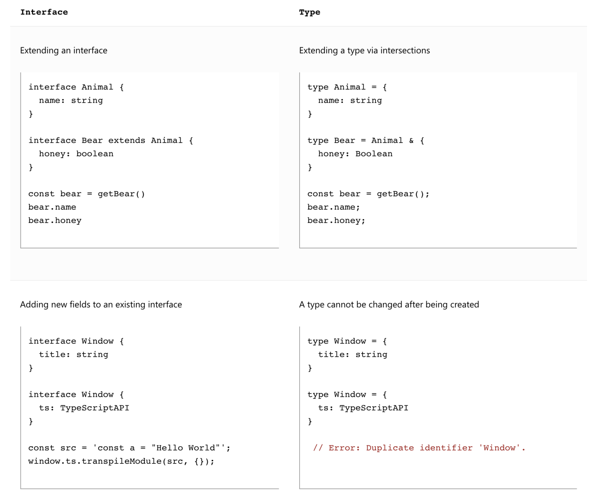

<a name="28672e27"></a>

## 基础类型

<a name="5e44db3d"></a>

### 原始值类型

原始值类型，ts 会自动推导出来。

类型语法：string，number，boolean

```typescript
const a: string = 'hello ts';
const b: number = 2;
const c: boolean = true;
```

需要注意的是：String, Number, Boolean 在 TS 里都是有效值，但平时使用中几乎不会用到。

<a name="f45a735a"></a>

### 数组类型

如下定义：

```typescript
// 可以使用[]进行类型定义
const numArr: number[] = [1, 2, 3];
const strArr: string[] = ['1', '2', '3'];
const booleanArr: boolean[] = [true, false];

// 也可以使用Array<T>进行类型定义
const numArr: Arrary<number> = [1, 2, 3];
const strArr: Arrary<string> = ['1', '2', '3'];
const booleanArr: Arrary<boolean> = [true, false];
```

<a name="25009be8"></a>

### 函数类型

函数主要定义入参和出参的类型：

```typescript
// function 定义
function identify(params: string): string {
  return params;
}

const identify2 = function (params: number): number {
  return params;
};

// 箭头函数
const arrowFunc = (i: boolean): boolean => {
  return i;
};

export type identifyType = typeof identify;
export type identify2Type = typeof identify2;
export type identify3Type = typeof arrowFunc;
```

todo-函数重载

<a name="1e767357"></a>

### 对象类型

最常用的类型，使用 ?: 可以让某个属性可选。

```typescript
const obj: {
  x: number;
  z: boolean;
  c?: string;
} = {
  x: 1,
  z: false,
  c: '',
};
```

<a name="0359e3b7"></a>

### 联合类型（Union Types）

简单来说就是，一个变量可能有多个类型选项。

当一个函数入参可能是这种类型，或者是那种类型。就可以使用联合类型。如下：

```typescript
const printId = (id: number | string) => {
  console.log('Your ID is: ' + id);
};

printId(1);
printId('str');
// printId(true); 此处会提示类型错误
```

有一个问题，既然变量可能有多个类型定义，你就不能只使用属于某个类型定义的属性。

```typescript
const printId = (id: number | string) => {
  console.log(id.toUpperCase()); // 此处会提示类型错误
};
```

此时你需要做一个操作，类型收窄，即判断了类型再使用相应类型的属性。

```typescript
const printId = (id: number | string) => {
  if (typeof id === 'string') {
    // In this branch, id is of type 'string'
    console.log(id.toUpperCase());
  } else {
    // Here, id is of type 'number'
    console.log(id);
  }
};
```

<a name="0733e651"></a>

### 类型别名（Type Aliases）

上面都是直接在变量后面追加类型定义，很方便，但是不方便复用。这个时候你就可以考虑类型别名。

```typescript
// 对象类型 别名Point
type Point = {
  x: number;
  y: number;
};

// 联合类型 别名ID
type ID = string | number;
```

<a name="d1ef6fc6"></a>

### 接口类型（Interfaces）

还有一种方式定义对象类型的别名。

```typescript
interface Point {
  x: number;
  y: number;
}
```

接口类型和类型别名的差异



搬官网的，
interface 可以使用 extends 继承。定义多个同名 interface 可以合并属性。

Type 可以使用 & 进行继承合并。多个同名 Type 会报错。

个人补充一点，类型计算一般都使用的 Type . 无法使用 interface .

```typescript
// 以下会报错
interface I<T>{
   [i in keyof T] : T[i]
}

// 以下不会
export type D<T> = {
  [i in keyof T]: T[i];
};
```

<a name="89a8faee"></a>

### 类型断言

有些时候，typescript 并不能推断出具体的类型。

像下面这样的

```typescript
const myCanvas = document.getElementById('main_canvas');
```

typescript 只能推断出它属于`HTMLElement`类型，但你是明确知道元素是`HTMLCanvasElement`。这种时候你就可以使用类型断言，像下面这样

```typescript
const myCanvas = document.getElementById('main_canvas') as HTMLCanvasElement;
```

<a name="7d4bfe47"></a>

### 字面量类型

字面量类型，顾名思义就是像下面这样，`a`的类型就固定为`test`了，不是`string`。

```typescript
let a: 'test' = 'test';
```

需要特别注意的是，取决于 Javascript 声明变量的方式，TS 会推断出不同的类型。`let`、`var`声明的变量都允许修改。`const`则不允许。

因此对于`let`、`var`声明的变量：

```typescript
let str = 'str'; // 推断为 string 类型
let num = 'num'; // 推断为 number 类型
let b = true; // 推断为 boolean 类型
```

对于`const`声明的变量：

```typescript
const str = 'str'; // 推断为字面量 'str' 类型
const num = 'num'; // 推断为字面量 'num' 类型
const b = true; // 推断为字面量 true 类型
```

但当在用 const 声明一个对象时，TS 会默认该对象的属性都是可以修改的。所以推断出的类型都是基本类型。如果你想推断为字面量的类型，需要在后面加上`as const`，示例如下：

```typescript
// 以下推断出的类型为
interface {
  url : string;
  method : string;
}
const req = { url: "https://example.com", method: "GET" };

// 以下推断出的类型为
interface {
  url : "https://example.com";
  method : "GET";
}

const req = { url: "https://example.com", method: "GET" } as const;
```

<a name="741a5868"></a>

### null、undefined

`JavaScript`有两个特殊的类型`null`和`undefined`用于代表不存在或者未初始化。

`TypeScript`也有这两个相对应的类型的定义`null`和`undefined`。

这两个类型和`strictNullChecks`配置相关，当配置为`off`时，这两个类型可以赋值给任意类型，不会报错。当配置为`on`时，使用之前需要先检查是否为空，否则`TS`会提示错误。

```typescript
function doSomething(x: string | null) {
  if (x === null) {
    // do nothing
  } else {
    console.log('Hello, ' + x.toUpperCase());
  }
}
```

你也可以使用`!`进行非空断言，但需要注意的是，类型断言不会影响代码运行时的行为，你需要自己确保这个值不会为空值。

```typescript
function liveDangerously(x?: number | null) {
  // No error
  console.log(x!.toFixed());
}
```

<a name="enum"></a>

### enum

枚举是 `TypeScript` 添加到 `JavaScript` 的一项功能，与其它类型不同的是，枚举是会添加代码到运行时的，也就是说会影响你的代码。所以在使用枚举之前，确保你知道自己在做什么。
