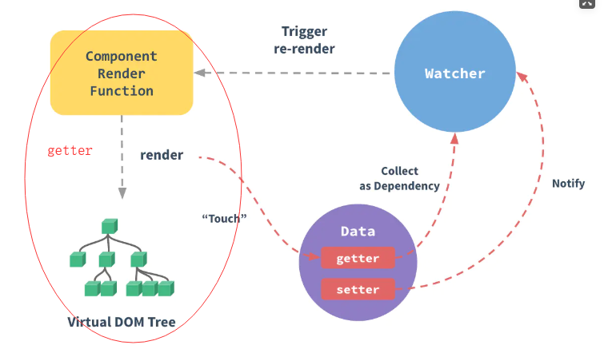

<a name="JNKp2"></a>

## 先看看vue的响应式

vue的响应式是指，当数据发生改变的时候，会自动去通知使用到该数据的代码。比如View，然后View就可以自动更新了。像下面这样：

```vue
<div id="root">{{text}}</div>

<script>
let vm = new Vue({
	el : "#root",
	data : {
		text: 'hello'
	}
})
//现在上面会显示,hello

vm.text = "world";
//当改变name的时候，View随即更新成了world。这就是响应式了。 
</script>
```

接下来，让我们一步一步看看vue的响应式到底是怎么回事吧。

<a name="SWna7"></a>

## 观察者模式

首先，我对什么模式不敢兴趣，我只对大白话感兴趣。

首先主角是数据data。也就是**被观察者**。那就会有对应的**观察者**watcher。当data发生改变的时候，通知所有的watcher。

看起来像这样。

```javascript
data -> watcher
```

但是由于一个data可能有多个观察者，也就是一对多的关系。在Vue里，每个data对应一个Dep对象，Dep就可以把所有watcher存下来了。
然后就像这样了。

```javascript
data -> Dep -> watchers
```

其中Dep有两个关键的属性。
Dep

- id -- 唯一标识符
- subs -- array类型，存放所有的watcher

然后再看watcher。
Vue中watcher 观察的实际对象 是一个函数/求值表达式。这个函数/求值表达式在vue实例里执行，所需要用到的数据，也就是watcher所依赖的数据。watcher有一个属性deps用于记录这些依赖。而函数/求值表达式本身则作为watcher的getter属性储存起来。当需要计算值的时候，会调用getter进行计算，计算所得结果保存在wathcer的value属性上。

额外多说一个属性cb，记录回调函数，当getter得出的值与当前value不一样的时候，会调用。

所以Watcher现在看起来像这样。
Watcher

- vm -- vue实例
- deps -- array类型，记录所有依赖的数据
- getter --  函数/求值表达式本身
- value -- * 每次计算的值保存在此处
- cb -- 当getter得出的值与当前value不一样的时候，会调用

> PS：这里多说一句，虽然data是作为**被观察者**存在的，但**观察者**watcher并不是直接观察data的，而是观察一个函数，也就是求值表达式，求值过程中所用到的data，都被观察了。
> \~~我一直都错误的以为watcher是直接观察data的。~~

理论太多了，来看一个实际的例子理一理他们的关系。

```javascript
let vm = new Vue({
	data : { 
  	name : "zack",
    age : "26"
  }
});

function hello (){
	return `hello ${this.name} ${this.age}`;
}

const changeCB = str=>console.log(str);

vm.$watch(hello, changeCB);

//现在当你改变vm里data的数据
vm.age = 30;// hello zack 30
vm.name = "world";//hell world 30
```

用现有的东西解释一下上面发生了些什么。在new Vue的过程中。给name 和 age创建了对应的Dep。并劫持了属性的get/set方法。

```javascript
name -> dep1
age  -> dep2
```

调用$watch过后。产生一个新的watcher，并收集到dep1，dep2作为依赖。并且，dep1和dep2都把watcher添加到自己的subs里。

```javascript
watcher.deps = [dep1,dep2]

dep1.subs = [wathcer]
dep2.subs = [wathcer]
```

然后就是当你改变name的时候，dep1就通知所有的watcher，然后watcher会执行getter得到新的value值，并调用cb。

```javascript
name -> dep1 -> wathcer -> getter -> value -> cb
```

然后然后就是你有没有发现上面的hello很像计算属性，computed。

```javascript
let vm = new Vue({
	data : {
  	name : "zack",
    age : "26"
  },
  computed : {
  	hello(){
			return `hello ${this.name} ${this.age}`
    }
  }
})
```

没错，计算属性肯定也是基于watcher实现的，但做了些改变。毕竟要是没有使用到计算属性，依赖的数据改变都要重新计算一次，有点浪费。这个稍后再说。

<a name="Q1Xz4"></a>

## 依赖关系

上面理了理 data / watcher / dep / watcher的观察对象(函数)，之间的关系。
下面就看看Vue理具体怎么去把这些依赖关系关联起来的把。

Vue的响应式核心代码都在[vue/src/core/observer](https://github.com/vuejs/vue/tree/v2.5.13/src/core/observer)目录下。
我们顺着上面的例子，一步一步来。

```javascript
let vm = new Vue({
	data : {
  	name : "zack",
    age : "26"
  }
});
```

对传入的data进行响应化初始的地方在[vue/src/core/instance/state.js](https://github.com/vuejs/vue/blob/v2.5.16/src/core/instance/state.js)

[state.js#L149](https://github.com/vuejs/vue/blob/v2.5.13/src/core/instance/state.js#L149)

```javascript
// new Vue() -> ... -> initState() -> initData()
observe(data)
```

observe的目的是为了让data成为响应式的，它会遍历整个data的属性，然后调用defineReactive。

[observer/index.js#L64](https://github.com/vuejs/vue/blob/v2.5.13/src/core/observer/index.js#L64)

```javascript
//observe() -> new Observer() -> observer.walk()
defineReactive(obj, key, value)
```

defineReactive()是定义响应式的核心函数。它主要干了以下几件事：

1. 为当前数据新建一个Dep对象。
2. 使用Object.defineProperty()重新设置对象属性的get/set方法，从而劫持属性，让属性值被改变或者获取的时候可以执行vue的代码。（详细一点的话就是，属性被 改变时，调用Dep里subs的所有watcher的update(),属性被获取的时候，添加依赖到dep的subs里。）

vue的实例化到这告一段落。但还需要说一点，传入Vue的data的所有属性，会被代理到创建的Vue实例上，这样操作vm.name，实际上也就是操作vm.data.name。

接着是watcher的创建。

```javascript
vm.$watch(hello, changeCB);
```

上述代码执行后，会调用：
[state.js#L346](https://github.com/vuejs/vue/blob/v2.5.13/src/core/instance/state.js#L346)

```javascript
//Vue.prototype.$watch()
new Watcher(vm,expOrFn,cb,options)
//传入我们代码里的参数，也就是
new Watcher(vm,hello,changeCB,{/*略*/})
```

在watcher的创建过程中，除了记录了vm，getter，cb，以及其它一些必要工作外，最重要的是调用了一次getter。

[watcher.js#L103](https://github.com/vuejs/vue/blob/v2.5.13/src/core/observer/watcher.js#L103)

```javascript
//new Watcher() -> this.get()
value = this.getter.call(vm,vm)
```

在getter的执行过程中，需要对数据进行读取，就触发了之前通过defineReactive()配置过的get方法。

[observer/index.js#L156](https://github.com/vuejs/vue/blob/v2.5.13/src/core/observer/index.js#L156)

```javascript
//其中有一段代码简化如下
if (Dep.target) {
  dep.depend()
}
```

这是在做什么呢？回到wathcer.get()方法,你会看到。

[watcher.js#L103](https://github.com/vuejs/vue/blob/v2.5.13/src/core/observer/watcher.js#L103)

```javascript
pushTarget(this)
//...
value = this.getter.call(vm,vm)
//...
popTarget()
```

这个pushTarget/popTarget都是[Dep](https://github.com/vuejs/vue/blob/v2.5.13/src/core/observer/dep.js#L51)提供的方法，目的是为了执行getter的时候，保证Dep.target就是当前的watcher。然后通过dep.depend()建立依赖关系。

[dep.js#L30](https://github.com/vuejs/vue/blob/v2.5.13/src/core/observer/dep.js#L30)
[watcher.js#L134](https://github.com/vuejs/vue/blob/4f111f9225f938f7a2456d341626dbdfd210ff0c/src/core/observer/watcher.js#L134)

```javascript
//dep.depend() 把dep添加进watcher的依赖里
 if (Dep.target) {
 	Dep.target.addDep(this)
 }
//watcher.addDep() -> dep.addSub() dep把watcher保存进subs数组
if (!this.depIds.has(id)) {
  dep.addSub(this)
}
```

最后一步，数据改变的时候发生了些什么。

```javascript
vm.age = 30;// hello zack 30
```

改变属性的值，会触发defineReactive()设置过的set方法。

[observer/index.js#L183](https://github.com/vuejs/vue/blob/v2.5.13/src/core/observer/index.js#L183)

```javascript
//defineReactive() -> set() -> dep.notify() -> watcher.update()
dep.notify()
```

notify方法会调用所有subs里的watcher.update().
[dep.js#L36](https://github.com/vuejs/vue/blob/v2.5.13/src/core/observer/dep.js#L36)

```javascript
  for (let i = 0, l = subs.length; i < l; i++) {
    subs[i].update()
  }
```

这样相关的watcher都被通知到了，知道了数据的改变，就可以进行后续的处理，先暂时放一放。

到这里响应式的机制就基本清楚了。

- 通过Object.defineProperty()方法劫持对象属性的set/get方法，让其在相应的时候执行vue的代码。
- watcher在执行getter的时候，触发对应属性的已经被修改过的get方法，从而建立两者的依赖。
- 对属性值进行更改时，触发已经被修改过的set方法，进而通知相关watcher做相应操作。

现在看看官网贴的那张关于响应式的图。[链接](https://vuejs.org/v2/guide/reactivity.html)



图里watcher/data都有了，暂时把左边那一堆当成getter。就都有了。这样看起来就比较好理解了。
实例化Vue的时候，observe(data)为所有属性添加get/set方法，新建watcher，会执行一次getter，触发data属性的get方法，进行依赖收集，与watcher建立关系。当改变data数据的时候，notify告知watcher进行更新。

<a name="WBLg3"></a>

## 计算属性（ComputedWatcher ）

计算属性也是由watcher实现得，不过明显得不同有两点：1.不需要cb。2.需要时才计算，而且会缓存。

在创建ComputedWatcher时，getter不会立即执行，也就是一开始不会计算值，依赖关系也没有计算出来。
Comp
那么计算属性的值在被获取的时候，会走下面的逻辑。

[state.js#L238](https://github.com/vuejs/vue/blob/v2.5.13/src/core/instance/state.js#L238)

```javascript
if (watcher) {
  if (watcher.dirty) {
    watcher.evaluate()
  }
  if (Dep.target) {
    watcher.depend()
  }
  return watcher.value
}
```

watcher的dirty属性代表需不需要计算值value。
在创建ComputedWatcher时，并没有执行getter，所以会设置dirty为true。然后当计算属性值被获取时，会走watcher.evaluate()，计算值value，并把dirty设置为false。这样下次获取值的时候就不用重新计算了。

相对应的，当调用watcher.evaluate()时，会执行到getter，收集到依赖，当这些依赖发生改变时，通知到watcher，watcher只是把dirty设置为true，并不会立即计算出新的值，下一次被获取的时候才会去计算。

另外还有一点，计算属性本身也是作为值存在的，所以是可以被其它watcher依赖的，当其它watcher收集依赖到计算属性的时候，计算属性并没有一个对应的Dep去让watcher收集，它只能把自己的deps里的dep全部给收集者。也就是代码中的watcher.depend()，它会遍历所有dep，调用dep.depend()。

<a name="bymVu"></a>

## RenderWatcher 及异步更新

RenderWatcher顾名思义，就是更新view用的watcher，一个vm只有一个对应的RenderWatcher，保存在vm.\_watcher上。

RenderWatcher 的创建，在函数 [mountComponent](https://github.com/vuejs/vue/blob/v2.5.13/src/core/instance/lifecycle.js#L143) 中：

```javascript
let updateComponent = () => {
  vm._update(vm._render(), hydrating)
}
new Watcher(vm, updateComponent, noop, null, true /* isRenderWatcher */)
```

有了上面的知识，直接看关键部分，该watcher的cb是noop，等于不需要，确实也不需要。getter是updateComponent。
也就是说，执行到watcher.get()的时候，会执行到updateComponent()进而更行了view，同时也收集到了依赖，依赖发生改变时，通知watcher，然后更新view。

但是这里如果，频繁改变数据，那不是会频繁更新view？所以这里的更新是异步更新的。

数据改变后，会执行到watcher.update()方法。

[observer/watcher.js#L161](https://github.com/vuejs/vue/blob/v2.5.13/src/core/observer/watcher.js#L161)

```javascript
if (this.lazy) {
  this.dirty = true
} else if (this.sync) {
  this.run()
} else {
  queueWatcher(this)
}
```

第一种情况，lazy 为 true，也就是计算属性，只是标记 dirty 为 true，并不立即计算。
第二种情况，sync 为 true 的情况，就是立即执行计算。
第三种情况，就是这里 的RenderWatcher ，并不立即执行，而是放到了一个队列中。

这个队列是干什么的呢？
相关代码在 [observer/scheduler.js](https://github.com/vuejs/vue/blob/v2.5.13/src/core/observer/scheduler.js) 中，简单来说，RenderWatcher 将其 getter，也就是 updateComponent 函数异步执行，并且，多次触发
RenderWatcher 的 update()，最终也只会执行一次 updateComponent。

至于什么时机执行updateComponent。就暂时不展开了。
