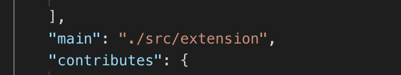
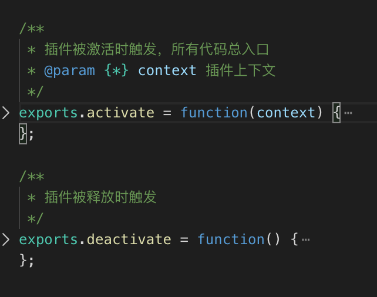
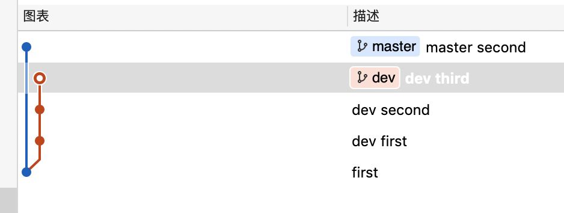
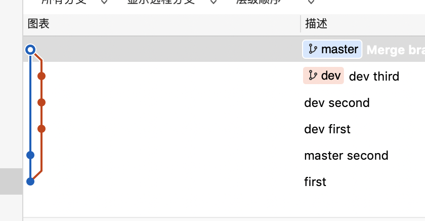
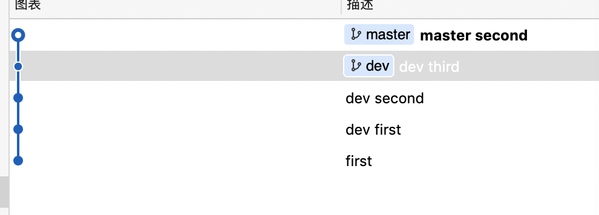
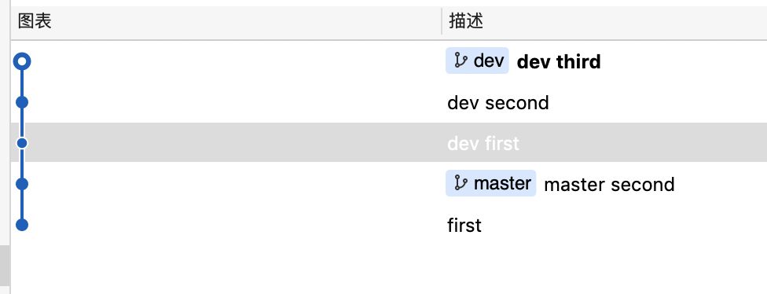
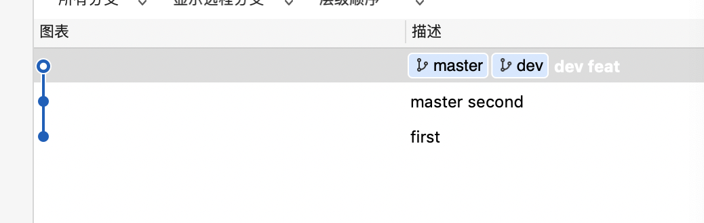
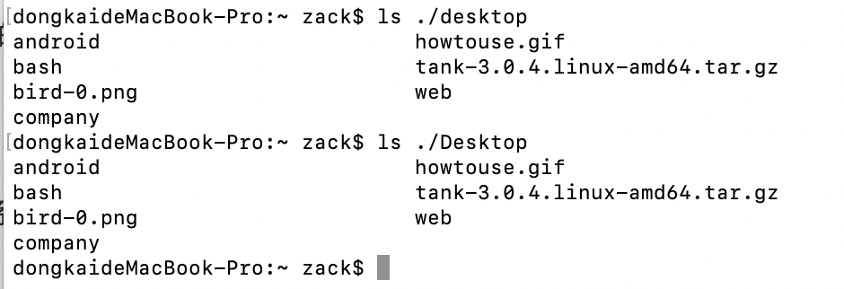
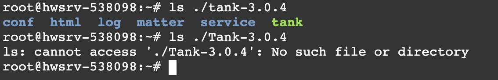

## VSCODE JS代码片段

vscode插入代码片段，直接设置里搜索user snippets

```json
	"react class component": {
		"prefix": "rcc",
		"body": [
			"import React, { Component } from 'react'",
			"class $1 extends Component {",
			"    render(){",
			"        return (<div></div>);",
			"    }",
			"}",
			"export default $1;"
		],
		"description": "react class component"
	},

	"react function component": {
		"prefix": "rfc",
		"body": [
			"import React from 'react';",
			"const $1 = (props)=>{",
			"    return (",
			"        <div>$1</div>",
			"    );",
			"}",
			"export default $1;"
		],
		"description": "react function component"
	},
```


## mac下mysql 相关命令

mysql.server start

mysql.server stop


## vscode 插件相关的

1.package.json里main会记录入口文件



入口文件 有两个固定的函数



注册一个命令，会返回Disposable对象，该对象需要放到context.subscriptions里
所以会看到下面这种格式的代码，固定写法

```javascript
context.subscriptions.push(vscode.commands.registerCommand('extension.sayHello2', () => {
    vscode.window.showInformationMessage('Hello World！你好，小茗同学！');
}));


vscode.commands.registerCommand('命令名','执行命令时调用的函数')
context.subscriptions.push(Disposable)
```


## CSS之盒模型


#### 行内框盒子模型

1.内容区高度
2.内联盒子
3.行框盒子

#### 块级元素盒模型

IE盒模型：width = content + padding + border
正常盒模型: width = content


## react-router4.0注意点


### 路由匹配组件


#### route

route主要是通过对比当前url路径和组件上path属性。匹配上就会渲染组件，否则不渲染。
当route没有path属性时，它总是被匹配的，也就是总会被渲染。

#### switch

switch主要用于包含一堆route，并保证只渲染第一个匹配上的route。
所以switch里的子route顺序是对匹配有影响的。


## 分支合并中的一些细节

现在有一个master 一个 dev 
master上有一个节点
dev上有三个节点



直接merge dev到 master 产生的结果是


这样看着太不舒服了。。。

换rebase
这是 在master。  然后。git rebase dev 的结果 



这是在dev 然后 git rebase master 的结果。。。


这个是 在dev 上  git rebse master -i 合并了三个节点的结果。。。并merge dev 到 master了




## 正则学习

**匹配整数或者小数（包括正数和负数）**
**
/-?\d+(.\d)*/

**匹配年月日日期 格式2018-12-6**

**自己写的**/\d{4}-\d{2}-\d{2}/
优化了下
/(19|20)\d{2}-(0?\[1-9]|1\[012])-(0?\[1-9]|\[12]\d|3\[01])/

百度了下，还不包括闰年 2月份的匹配
((((19|20)\d{2})-(0?\[13578]|1\[02])-(0?\[1-9]|\[12]\d|3\[01]))|(((19|20)\d{2})-(0?\[469]|11)-(0?\[1-9]|\[12]\d|30))|(((19|20)\d{2})-0?2-(0?\[1-9]|1\d|2\[0-8])))

**11位的电话号码**
不太清楚第二位的号段
/1\[35678]\d{9}/

**匹配验证码：4位数字字母组成的**
**/^\[0-9a-zA-Z]{4}$/

**匹配邮箱地址**
/^\[\w]+@\[\w]+.\[\w]+$/

```javascript
const axios = require("axios");
const http = require('http');
const path = require('path');
const fs = require('fs');
const url = "http://172.26.66.38/src/";

axios.get(url).then(res=>{
    const allLinks = getAllLink(res.data);
    checkIfFiles(url,"ui/",allLinks);
    console.log(allLinks);
});


const getAllLink = ( html )=>{
    const links = html.match(/<a[^>]+?href=["']?([^"']+)["']?[^>]*>([^<]+)<\/a>/g);
    if(!links)return[];
    const linkObjArr = links.map(link=>{
        const obj = {};
        const a = link.match(/.+href=["']?([^"']*)["']?/);
        const b = link.match(/<a[^>]+>([^<]+)</);
        obj.link = a?a[1]:null;
        obj.text = b?b[1]:null;
        return obj;
    });
    return linkObjArr.filter(link=>!link.link.includes("../"));
}

const checkIfFiles = async (url,dir,allLinks)=>{
    for (let i = 0; i < allLinks.length; i++) {
        const linkObj = allLinks[i];
        const { link, text } = linkObj;
        const urlNow = url + link;
        const dirNow = dir + text;
        console.log(urlNow);
        await new Promise((resolve)=>setTimeout(resolve,500));
        if(text.includes("/")){
            const html = await axios.get(urlNow);
            const allLinks = getAllLink(html.data);
            await checkIfFiles(urlNow,dirNow,allLinks);
        }else{
            console.log("it is file");
            console.log(dirNow);
            await downloadFileAsync(urlNow,dirNow)
        }        
    }
}


function downloadFileAsync(uri, dest){
  return new Promise((resolve, reject)=>{
    // 确保dest路径存在
    fs.mkdirSync(path.dirname(dest),{recursive :true});
    fs.writeFileSync(dest);
    const file = fs.createWriteStream(dest);
    http.get(uri, (res)=>{
      if(res.statusCode !== 200){
        reject(response.statusCode);
        return;
      }

      res.on('end', ()=>{
        console.log('download end');
      });

      // 进度、超时等

      file.on('finish', ()=>{
        console.log('finish write file')
        file.close(resolve);
      }).on('error', (err)=>{
        fs.unlink(dest);
        reject(err.message);
      })

      res.pipe(file);
    });
  });
}

```


## 向当前页面注入script标签

```javascript
var htmm =document.getElementsByTagName("html")[0];
var scri = document.createElement("script");
scri.async="async"
scri.src="https://cdn.jsdelivr.net/npm/immer/dist/immer.umd.js"
scri.onload=function(){console.log("script onloaded");}
htmm.appendChild(scri);
```


## GIT SSL错误

错误内容：`OpenSSL SSL_connect: SSL_ERROR_SYSCALL`

原因简述：当你通过HTTPS访问Git远程仓库的时候，如果服务器的SSL证书未经过第三方机构(例如：CA)签署，那么Git就会报错。原因是因为未知的没有签署过的证书意味着可能存在很大的风险。

解决办法：
全局忽略git的ssl证书验证：
`git config --global http.sslVerify false `

单项目忽略git的证书验证：
`export GIT_SSL_NO_VERIFY=true`
`git clone https://host_name/git/project.git`
`//拉项目`
`git config http.sslVerify "false"`


## git大小写不敏感问题

Windows/Mac OS 操作系统文件的大小写是不敏感的，不管文件路径是何种奇怪的大小写，我们始终可以以另一种大小写的方式访问到这个路径种的文件或者文件夹。Linux 操作系统文件的大小写却是敏感的，不同大小写意味着不同的路径。于是，Windows 下的 A 文件在 Docs 文件夹下，B 文件在 docs 文件夹下，最终效果是 A B 都在 docs 文件夹下；而同样的情况放到 Linux 中，A B 就在两个不同的文件夹。

**Mac OS下文件大小写不敏感**



**Windows下文件大小写不敏感**

**Linux下文件大小写敏感**



Git 是大小写不敏感的，导致跨操作系统共享的 Git 仓库就会遇到上面的情况。如果重命名的文件或文件夹只有大小写不同，那么对 Git  来说甚至都没有变化。

解决办法链接：<https://cloud.tencent.com/developer/article/1341157>


## react hook 里使用防抖 节流会有问题待解决


## 翻墙工具 全局代理 无法代理命令行工具

需要设置你所在的命令行工具把请求转发到 翻墙工具的端口上。
android studio 可以在 gradle.properties 添加代理

    systemProp.https.proxyPort=7890
    systemProp.http.proxyHost=127.0.0.1
    systemProp.https.proxyHost=127.0.0.1
    systemProp.http.proxyPort=7890
