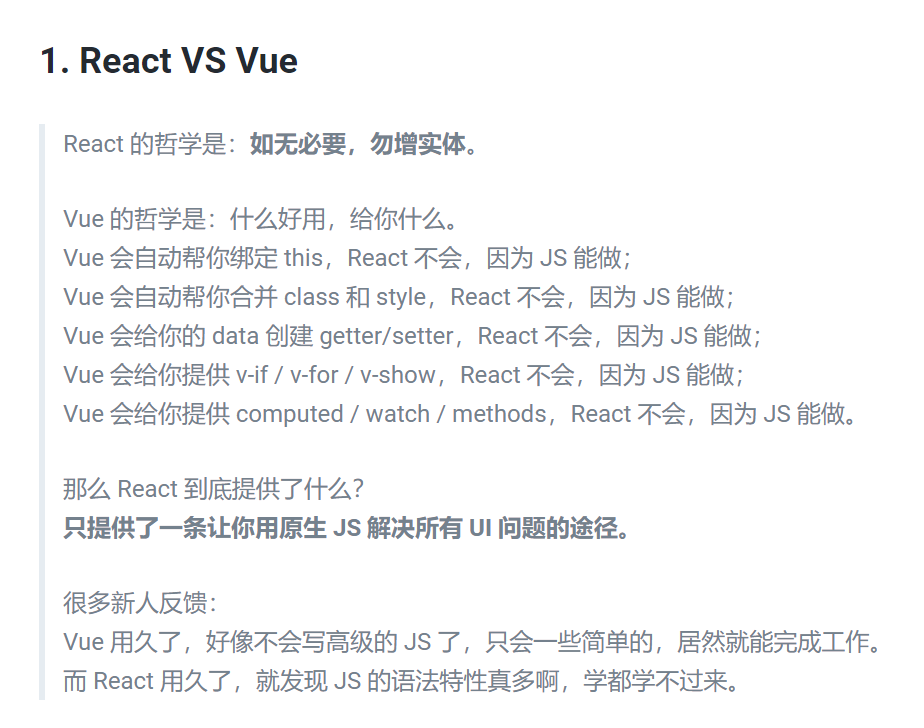

经常被问，react和vue的差异。其实最大差异在官网的自我介绍中，就已经很明显了。

> React: A JavaScript library for building user interfaces.

<a name="Xu24j"></a>

##

> Vue: The Progressive JavaScript Framework.

一个是库，一个是框架。框架专注于大而全，内嵌所有必须的功能，努力提供一个好的开发环境给开发者。库提供的功能相对来说更简单，单一。但专注于该功能，并尽力做到最好。

<a name="Qdy1O"></a>

## 组件

React 和 Vue 都提供了组件，前端组件泛泛来说一般包含三个部分：

1. 界面(HTML)
2. 交互（JavaScript）
3. 样式（CSS）

<a name="5jmVS"></a>

### Vue

Vue 提供的单文件组件，同时包含了这三部分，而且还内置了[classNames](https://github.com/JedWatson/classnames)。（非常方便开发者）

- **样式**是内置的功能
- 内置了[classNames](https://github.com/JedWatson/classnames),来提供class和style的动态计算和绑定
- 行内样式，[自带css兼容前缀](https://cn.vuejs.org/v2/guide/class-and-style.html#%E8%87%AA%E5%8A%A8%E6%B7%BB%E5%8A%A0%E5%89%8D%E7%BC%80)

Vue 的 class 绑定使用起来非常方便，完全感知不到[classNames](https://github.com/JedWatson/classnames)这个库的存在。

```vue
// template
<div
  class="static"
  :class="{ active: isActive, 'text-danger': hasError }"
></div>

// data
data() {
  return {
    isActive: true,
    hasError: false
  }
}

//result

<div class="static active"></div>
```

<a name="hYm3s"></a>

### React

React 组件包含了**交互**和**界面**，但不含**样式**。 但幸运的是 React 社区十分活跃，有大量用于处理 CSS 的库可以选择。但是：

- **样式**不是内置的功能
- 你必须知道这些CSS库的存在，并学习使用
- 支持行内样式，但没有兼容性前缀

没有内置[classNames](https://github.com/JedWatson/classnames)，你需要install，再使用。或者你也可以使用JavaScript自己计算，因为JavaScript确实可以做到。

<a name="UCs7b"></a>

## 状态管理和路由

随着前端程序变得越来越大，越来越复杂，**状态管理**和**路由**都是必不可少的部分。

<a name="m6VOK"></a>

### Vue

Vue 同样内置了处理这两部分的功能，并在官网文档中有明确的提及到。

- Vue Router 处理**路由**
- Vuex 处理**状态管理**
- 最最重要的是，这两个库由 Vue 核心团队维护

这让新上手 Vue 的开发者，很明确的知道自己需要那些库来解决这些问题，没有挑选成本。（非常方便开发者）

<a name="CxVe1"></a>

### React

React 处理这两部分的库，同样是由社区开发维护的，而且多种可选，有一定挑选成本。

- **路由**  React-Router
- **状态管理  **Redux/Mobx
- 都由社区开发维护

而且从个人使用体验来说，React这些库的学习成本都比较高。（原因？） <a name="fQ0oJ"></a>

##

<a name="yBurc"></a>

## 指令（Vue独有）

> 指令 (Directives) 是带有 v- 前缀的特殊 attribute。指令 attribute 的值预期是单个 JavaScript 表达式 (v-for 是例外情况，稍后我们再讨论)。指令的职责是，当表达式的值改变时，将其产生的连带影响，响应式地作用于 DOM。

<a name="k0DGX"></a>

### 指令修饰符

尤其是指令修饰符，极大的方便了开发者的使用。

```vue
<!-- the click event's propagation will be stopped -->
<a @click.stop="doThis"></a>

<!-- the submit event will no longer reload the page -->
<form @submit.prevent="onSubmit"></form>

<!-- modifiers can be chained -->
<a @click.stop.prevent="doThat"></a>

<!-- just the modifier -->
<form @submit.prevent></form>
```

<a name="aZd0H"></a>

### 自定义指令

```javascript
const app = Vue.createApp({})
// Register a global custom directive called `v-focus`
app.directive('focus', {
  // When the bound element is mounted into the DOM...
  mounted(el) {
    // Focus the element
    el.focus()
  }
})

<input v-focus />
```

<a name="OVzdu"></a>

## v-modal（vue独有）

针对form表单，vue 还有一个比较方便的指令 [v-modal](https://cn.vuejs.org/v2/guide/forms.html) 。

> 你可以用 v-model 指令在表单 <input>、<textarea> 及 <select> 元素上创建双向数据绑定。它会根据控件类型自动选取正确的方法来更新元素。尽管有些神奇，但 v-model 本质上不过是语法糖。它负责监听用户的输入事件以更新数据，并对一些极端场景进行一些特殊处理。

<a name="LZBIa"></a>

##

贴一点和 react 对比的代码：

```javascript
// Input
////////

// React
<input type="input" value={message} onChange={onChange} />

// Vue.js
<input type="input" v-model="message" />

// Checkboxes and Radiobuttons
////////

// React
<input type="checkbox" checked={message != null} onChange={onChange} />

// Vue.js
<input type="checkbox" v-model="message" />

// Select
////////

// React
<select value={message} onChange={onChange}>
	<option>A</option>
</select>

// Vue.js
<select v-model="message">
	<option>A</option>
</select>
```

这里文档很明确的指出了**双向绑定**这个概念，因为的确，它符合双向绑定的概念 。数据改变，自动同步改变到UI上，Form 表单的变动，自动同步到了数据。 <a name="OO1Sy"></a>

##

另外网上经常说 vue 是双向绑定的，贴几个概念在这里：

- 一般只有UI表单控件才存在双向数据绑定，非UI表单控件只有单向数据绑定。
- 单向数据绑定是指：M的变化可以自动更新到ViewModel，但ViewModel的变化需要手动更新到M（通过给表单控件设置事件监听）
- 双向数据绑定是指念：M的变化可以自动更新到ViewModel，ViewModel的变化也可以自动更新到M
- 双向绑定 = 单向绑定 + UI事件监听。双向和单向只不过是框架封装程度上的差异，本质上两者是可以相互转换的。 <a name="5mViB"></a>

##

<a name="SZXJB"></a>

### 其它一些差异

在 React 应用中，当某个组件的状态发生变化时，它会以该组件为根，重新渲染整个组件子树。
在 Vue 应用中，组件的依赖是在渲染过程中自动追踪的，所以系统能精确知晓哪个组件确实需要被重渲染。

虽然React中可以通过`PureComponent` 或者 `shouldComponentUpdate`来优化掉不必要的渲染，但这个过程是交给用户的。

React 对数据变化毫无感知。

Vue 则明确得知道view需要那些数据，并监测数据得变化。

其它看到的一些比较有趣的观点：

react 相对于 vue 模板语言，缺少编译时的优化手段。



<a name="Y1hNT"></a>

##
